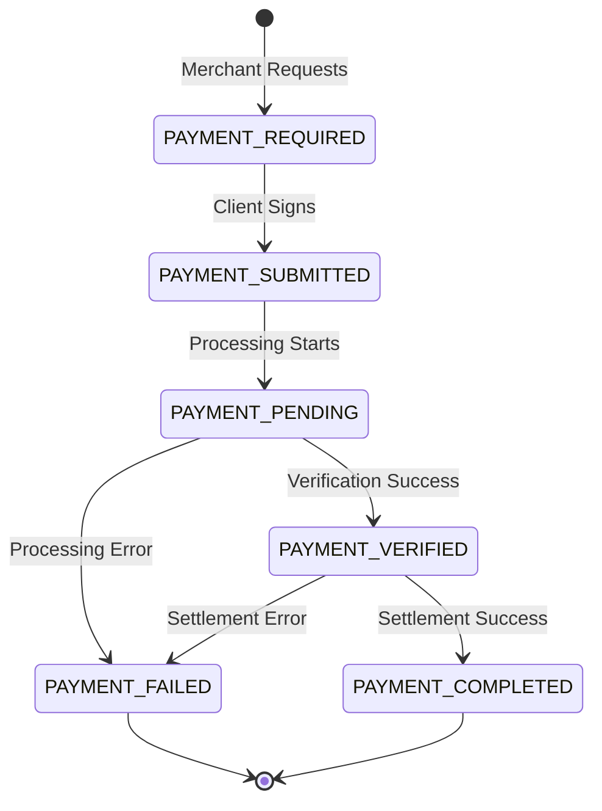
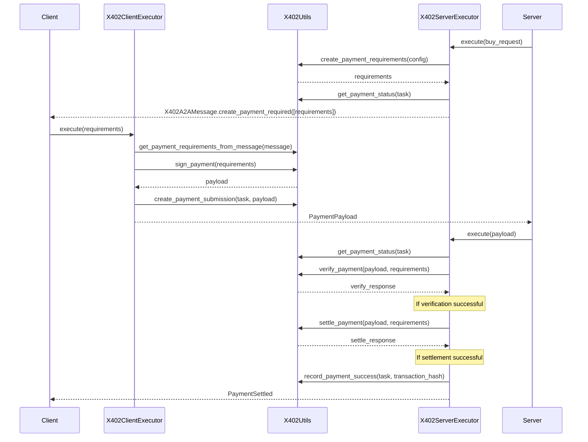

# x402 A2A Payment Protocol Extension

This document specifies the x402 payment protocol extension for A2A. The x402 extension provides both a functional core for payment protocol operations and middleware executors for common integration patterns.

## 1. Package Structure

The x402 extension follows a "functional core, imperative shell" pattern:

```
a2a_x402/
├── core/                  # Functional Core
│   ├── merchant.py       # Merchant utilities
│   ├── wallet.py         # Wallet utilities
│   ├── protocol.py       # Protocol definitions
│   └── utils.py          # Core utilities and state management
├── executors/            # Imperative Shell
│   ├── base.py          # Base executor types
│   ├── client.py        # Client-side executor
│   └── server.py        # Server-side executor
├── types/               # Shared Types
│   ├── config.py        # Configuration types
│   ├── messages.py      # Message types
│   ├── errors.py        # Error types
│   └── state.py         # State types
└── extension.py         # Extension declaration
```

## 2. Core Utilities

The package provides a central `X402Utils` class for state management and protocol operations:

```python
class X402Utils:
    """Core utilities for x402 protocol operations."""
    
    # Metadata Keys
    _PREFIX = "x402.payment"
    STATUS_KEY = f"{_PREFIX}.status"
    REQUIREMENTS_KEY = f"{_PREFIX}.requirements"
    PAYLOAD_KEY = f"{_PREFIX}.payload"
    TRANSACTION_HASH_KEY = f"{_PREFIX}.transaction_hash"
    ERROR_KEY = f"{_PREFIX}.error"
    ERROR_MESSAGE_KEY = f"{_PREFIX}.error_message"

    def get_extension_declaration(
        self,
        description: str,
        required: bool = True
    ) -> AgentExtension:
        """Creates extension declaration for AgentCard."""
        return AgentExtension(
            uri=X402_EXTENSION_URI,
            description=description,
            required=required
        )

    def get_payment_status(self, task: Task) -> Optional[PaymentStatus]:
        """Gets current payment status from task metadata."""
        if task and task.metadata and (status := task.metadata.get(self.STATUS_KEY)):
            try:
                return PaymentStatus(status)
            except ValueError:
                return None
        return None

    def get_payment_requirements(self, task: Task) -> Optional[PaymentRequirements]:
        """Gets payment requirements from task metadata."""
        if task.metadata and (req_data := task.metadata.get(self.REQUIREMENTS_KEY)):
            try:
                return PaymentRequirements.model_validate(req_data)
            except Exception:
                return None
        return None

    def get_payment_requirements_from_message(
        self,
        message: Message
    ) -> Optional[PaymentRequirements]:
        """Gets payment requirements from message metadata."""
        if message and message.metadata and (req_data := message.metadata.get(self.REQUIREMENTS_KEY)):
            try:
                return PaymentRequirements.model_validate(req_data)
            except Exception:
                return None
        return None

    def create_payment_submission(
        self,
        task: Task,
        payment: PaymentPayload
    ) -> Task:
        """Records payment submission in task metadata."""
        if task.metadata is None:
            task.metadata = {}
        task.metadata[self.STATUS_KEY] = PaymentStatus.PAYMENT_SUBMITTED
        task.metadata[self.PAYLOAD_KEY] = payment.model_dump(by_alias=True)
        return task

    def record_payment_success(
        self,
        task: Task,
        transaction_hash: str
    ) -> Task:
        """Records successful payment completion."""
        task.status.state = TaskState.completed
        if task.metadata is None:
            task.metadata = {}
        task.metadata[self.STATUS_KEY] = PaymentStatus.PAYMENT_COMPLETED
        task.metadata[self.TRANSACTION_HASH_KEY] = transaction_hash
        # Cleanup
        task.metadata.pop(self.REQUIREMENTS_KEY, None)
        task.metadata.pop(self.PAYLOAD_KEY, None)
        return task

    def record_payment_failure(
        self,
        task: Task,
        error: str,
        error_message: str
    ) -> Task:
        """Records payment failure with error details."""
        task.status.state = TaskState.failed
        if task.metadata is None:
            task.metadata = {}
        task.metadata[self.STATUS_KEY] = PaymentStatus.PAYMENT_FAILED
        task.metadata[self.ERROR_KEY] = error
        task.metadata[self.ERROR_MESSAGE_KEY] = error_message
        return task
```

## 3. State Management

### 3.1 Payment States

```python
class PaymentStatus(str, Enum):
    """Payment flow states"""
    PAYMENT_REQUIRED = "payment-required"    # Initial state
    PAYMENT_SUBMITTED = "payment-submitted"  # Payment signed and submitted
    PAYMENT_PENDING = "payment-pending"      # Payment being processed
    PAYMENT_VERIFIED = "payment-verified"    # Payment verified
    PAYMENT_COMPLETED = "payment-completed"  # Payment settled
    PAYMENT_FAILED = "payment-failed"        # Payment failed
```

### 3.2 State Transitions



## 4. Core Functions

The package exports granular functions for custom implementations:

### 4.1 Merchant Functions

```python
from a2a_x402.core import (
    create_payment_requirements,
    settle_payment,
    PaymentRequirementsConfig
)

# Create requirements
config = PaymentRequirementsConfig(
    price=price,
    resource="example-resource",
    merchant_address="0x...",
    network="base-sepolia",
    description="Example payment",
    mime_type="application/json",
    max_timeout_seconds=60
)

# Create and settle payments
requirements = create_payment_requirements(config, x402_config)
result = await settle_payment(payment_message, facilitator_config)
```

### 4.2 Wallet Functions

```python
from a2a_x402.core import process_payment
from eth_account import Account

# Process payment
result = await process_payment(
    requirements_message,
    account,
    max_value=1000000,
    scheme="exact"
)
```

## 5. Executor Middleware

The package provides executor middleware for common integration patterns:

### 5.1 Base Executor

```python
class X402BaseExecutor(AgentExecutor, ABC):
    """Base executor with x402 protocol support."""
    
    def __init__(
        self,
        delegate: AgentExecutor,
        config: X402ExtensionConfig
    ):
        self._delegate = delegate
        self.config = config
        self.utils = X402Utils()

    def is_active(self, context: RequestContext) -> bool:
        """Checks if x402 extension is activated."""
        if X402_EXTENSION_URI in context.requested_extensions:
            context.add_activated_extension(X402_EXTENSION_URI)
            return True
        return False
```

### 5.2 Server Executor

```python
class X402ServerExecutor(X402BaseExecutor):
    """Server-side executor for merchant implementations."""
    
    def __init__(
        self,
        delegate: AgentExecutor,
        config: X402ExtensionConfig,
        facilitator_config: Optional[FacilitatorConfig] = None
    ):
        super().__init__(delegate, config)
        self.facilitator_config = facilitator_config
    
    async def verify_payment(
        self,
        payload: PaymentPayload,
        requirements: PaymentRequirements
    ) -> VerifyResponse:
        """Verifies payment using core verification."""
        message = X402A2AMessage.create_payment_payload(
            payload,
            requirements,
            PaymentStatus.PAYMENT_SUBMITTED
        )
        return await verify_payment(message, self.facilitator_config)
        
    async def settle_payment(
        self,
        payload: PaymentPayload,
        requirements: PaymentRequirements
    ) -> SettleResponse:
        """Settles payment using core settlement."""
        message = X402A2AMessage.create_payment_payload(
            payload,
            requirements,
            PaymentStatus.PAYMENT_VERIFIED
        )
        return await settle_payment(message, self.facilitator_config)
        
    async def execute(
        self,
        context: RequestContext,
        event_queue: EventQueue
    ):
        """Executes with payment verification and settlement."""
        if not self.is_active(context):
            return await self._delegate.execute(context, event_queue)

        task = context.current_task
        status = self.utils.get_payment_status(task)

        if status == PaymentStatus.PAYMENT_SUBMITTED:
            # Handle payment verification and settlement
            payload = self.utils.get_submitted_payment(task)
            requirements = self.utils.get_payment_requirements(task)
            
            # Verify
            verify_response = await self.verify_payment(payload, requirements)
            if not verify_response.is_valid:
                task = self.utils.record_payment_failure(
                    task,
                    "verification_failed",
                    verify_response.invalid_reason
                )
                await event_queue.enqueue_event(task)
                return

            # Update state after verification
            task = self.utils.update_payment_status(
                task,
                PaymentStatus.PAYMENT_VERIFIED
            )

            # Settle
            settle_response = await self.settle_payment(payload, requirements)
            if settle_response.success:
                task = self.utils.record_payment_success(
                    task,
                    settle_response.transaction
                )
            else:
                task = self.utils.record_payment_failure(
                    task,
                    "settlement_failed",
                    settle_response.error_reason
                )
            await event_queue.enqueue_event(task)
            return

        # Default to delegate
        return await self._delegate.execute(context, event_queue)
```

### 5.3 Client Executor

```python
class X402ClientExecutor(X402BaseExecutor):
    """Client-side executor for wallet implementations."""
    
    def __init__(
        self,
        delegate: AgentExecutor,
        config: X402ExtensionConfig,
        account: Account,
        max_value: Optional[int] = None
    ):
        super().__init__(delegate, config)
        self.account = account
        self.max_value = max_value
    
    async def sign_payment(
        self,
        requirements: PaymentRequirements
    ) -> PaymentPayload:
        """Signs payment using core payment processing."""
        message = X402A2AMessage.create_payment_required(
            [requirements],
            status=PaymentStatus.PAYMENT_REQUIRED
        )
        return await process_payment(
            message,
            self.account,
            self.max_value
        )
        
    async def execute(
        self,
        context: RequestContext,
        event_queue: EventQueue
    ):
        """Executes with payment signing."""
        if not self.is_active(context):
            return await self._delegate.execute(context, event_queue)

        task = context.current_task
        requirements = None

        # Check task metadata first
        if task:
            requirements = self.utils.get_payment_requirements(task)

        # Fall back to message check
        if not requirements:
            requirements = self.utils.get_payment_requirements_from_message(
                context.message
            )

        if requirements:
            # Sign and submit payment
            payload = await self.sign_payment(requirements)
            task = self.utils.create_payment_submission(task, payload)
            await event_queue.enqueue_event(task)
            return

        # Default to delegate
        return await self._delegate.execute(context, event_queue)
```

## 6. Message Types

The package defines comprehensive message types:

```python
class X402MessageType(str, Enum):
    """Message types in payment flow"""
    PAYMENT_REQUIRED = "x402.payment.required"      # Initial payment request with requirements
    PAYMENT_REQUIREMENTS = "x402.payment.requirements"  # Payment requirements response
    PAYMENT_PAYLOAD = "x402.payment.payload"        # Signed payment payload
    PAYMENT_SETTLED = "x402.payment.settled"        # Settlement confirmation

class X402MessageMetadata(BaseModel):
    """Metadata for x402 A2A messages"""
    type: X402MessageType
    version: str
    requirements: Optional[PaymentRequirements] = None
    status: Optional[PaymentStatus] = None

class PaymentRequired(BaseModel):
    """x402 payment required response."""
    x402_version: int = X402Protocol.VERSION
    accepts: list[PaymentRequirements]
    error: Optional[str] = None

class X402A2AMessage(BaseModel, Generic[T]):
    """Base A2A message format for x402"""
    metadata: X402MessageMetadata
    data: T

    @classmethod
    def create_payment_required(
        cls,
        requirements: list[PaymentRequirements],
        error: Optional[str] = None,
        status: PaymentStatus = PaymentStatus.PAYMENT_REQUIRED
    ) -> "X402A2AMessage[PaymentRequired]":
        """Create initial payment request message."""
        return cls(
            metadata=X402MessageMetadata(
                type=X402MessageType.PAYMENT_REQUIRED,
                status=status
            ),
            data=PaymentRequired(
                accepts=requirements,
                error=error
            )
        )

    @classmethod
    def create_payment_requirements(
        cls,
        requirements: PaymentRequirements,
        status: PaymentStatus = PaymentStatus.PAYMENT_REQUIRED
    ) -> "X402A2AMessage[PaymentRequirements]":
        """Create payment requirements response message."""
        return cls(
            metadata=X402MessageMetadata(
                type=X402MessageType.PAYMENT_REQUIREMENTS,
                requirements=requirements,
                status=status
            ),
            data=requirements
        )

    @classmethod
    def create_payment_payload(
        cls,
        payload: PaymentPayload,
        requirements: PaymentRequirements,
        status: PaymentStatus = PaymentStatus.PAYMENT_SUBMITTED
    ) -> "X402A2AMessage[PaymentPayload]":
        return cls(
            metadata=X402MessageMetadata(
                type=X402MessageType.PAYMENT_PAYLOAD,
                requirements=requirements,
                status=status
            ),
            data=payload
        )

    @classmethod
    def create_settle_response(
        cls,
        response: SettleResponse,
        requirements: PaymentRequirements,
        status: PaymentStatus
    ) -> "X402A2AMessage[SettleResponse]":
        return cls(
            metadata=X402MessageMetadata(
                type=X402MessageType.PAYMENT_SETTLED,
                requirements=requirements,
                status=status
            ),
            data=response
        )
```

## 7. Error Handling

```python
class X402Error(Exception):
    """Base error for x402 protocol."""
    pass

class MessageError(X402Error):
    """Message validation errors."""
    pass

class ValidationError(X402Error):
    """Payment validation errors."""
    pass

class PaymentError(X402Error):
    """Payment processing errors."""
    pass

class StateError(X402Error):
    """State transition errors."""
    pass
```

## 8. Package Exports

```python
from a2a_x402 import (
    # Core Utilities
    X402Utils,
    PaymentStatus,
    
    # Core Functions
    create_payment_requirements,
    settle_payment,
    process_payment,
    
    # Executors
    X402BaseExecutor,
    X402ServerExecutor,
    X402ClientExecutor,
    
    # Types
    X402MessageType,
    X402MessageMetadata,
    X402A2AMessage,
    PaymentRequirements,
    PaymentPayload,
    SettleResponse,
    X402ExtensionConfig,
    
    # Errors
    X402Error,
    MessageError,
    ValidationError,
    PaymentError,
    StateError,
    
    # Skills
    SETTLE_PAYMENT_SKILL,
    PROCESS_PAYMENT_SKILL
)
```

## 9. Integration Patterns

The x402 extension provides two integration patterns: direct core function usage and executor middleware. These patterns can be used independently or together.

### 9.1 Direct Core Usage

For granular control, use core functions directly:

```python
from a2a_x402.core import (
    create_payment_requirements,
    settle_payment,
    process_payment,
    X402Utils
)

# Create utils instance
utils = X402Utils()

# Merchant Flow
async def handle_payment_request(price: str, resource: str):
    # Create requirements
    config = PaymentRequirementsConfig(
        price=price,
        resource=resource,
        merchant_address=MERCHANT_ADDRESS
    )
    requirements = create_payment_requirements(config, x402_config)
    
    # Update task state
    task = utils.request_payment(task, requirements)
    return X402A2AMessage.create_payment_required([requirements])

async def handle_payment_submission(task: Task):
    # Get payment from task
    payload = utils.get_submitted_payment(task)
    requirements = utils.get_payment_requirements(task)
    
    # Verify and settle
    result = await settle_payment(
        X402A2AMessage.create_payment_payload(payload, requirements),
        facilitator_config
    )
    
    # Update task state
    if result.success:
        task = utils.record_payment_success(task, result.transaction)
    else:
        task = utils.record_payment_failure(
            task,
            "settlement_failed",
            result.error_reason
        )
    return task

# Wallet Flow
async def handle_payment_requirements(task: Task):
    # Get requirements
    requirements = utils.get_payment_requirements(task)
    if not requirements:
        return None
        
    # Process payment
    result = await process_payment(
        requirements,
        account,
        max_value
    )
    
    # Update task state
    task = utils.create_payment_submission(task, result)
    return task
```

### 9.2 Executor Middleware

For standard integration patterns, use executors that wrap core functionality:

```python
# Server-side integration
from a2a_x402.executors import X402ServerExecutor
from a2a_x402.types import X402ExtensionConfig

# Create server executor
server_executor = X402ServerExecutor(
    delegate=base_executor,  # Your base ADK/LLM executor
    config=X402ExtensionConfig(
        scheme="exact",
        version="1.0.0",
        x402_version="1.0.0"
    ),
    facilitator_config=facilitator_config  # Your settlement config
)

# Create server application
app = A2AStarletteApplication(
    agent_card=merchant_agent.create_agent_card(url),
    executor=server_executor,
    task_store=InMemoryTaskStore()
)

# Client-side integration
from a2a_x402.executors import X402ClientExecutor
from eth_account import Account

# Create client executor
client_executor = X402ClientExecutor(
    delegate=base_executor,  # Your base ADK/LLM executor
    config=X402ExtensionConfig(
        scheme="exact",
        version="1.0.0",
        x402_version="1.0.0"
    ),
    account=Account.from_key(private_key),
    max_value=1000000  # Optional max payment value
)

# Create client application
app = A2AStarletteApplication(
    agent_card=wallet_agent.create_agent_card(url),
    executor=client_executor,
    task_store=InMemoryTaskStore()
)
```

### 9.3 Complete Payment Flow

Here's a complete payment flow using the x402 extension executors:



### 9.4 Implementation Guidelines

1. **Core Functions**
   - Pure functions with no side effects
   - Accept and return domain types
   - Handle core business logic
   - No knowledge of executors

2. **State Management**
   - Use `X402Utils` for all state changes
   - Keep state transitions in core
   - Validate state changes
   - Clean up metadata properly

3. **Message Creation**
   - Use `X402A2AMessage` factory methods
   - Include proper status
   - Validate requirements
   - Handle errors

4. **Executor Implementation**
   - Thin wrappers around core functions
   - Handle message routing
   - Manage task lifecycle
   - Coordinate state transitions

5. **Error Handling**
   - Use domain error types
   - Proper error propagation
   - Clean state on errors
   - Clear error messages