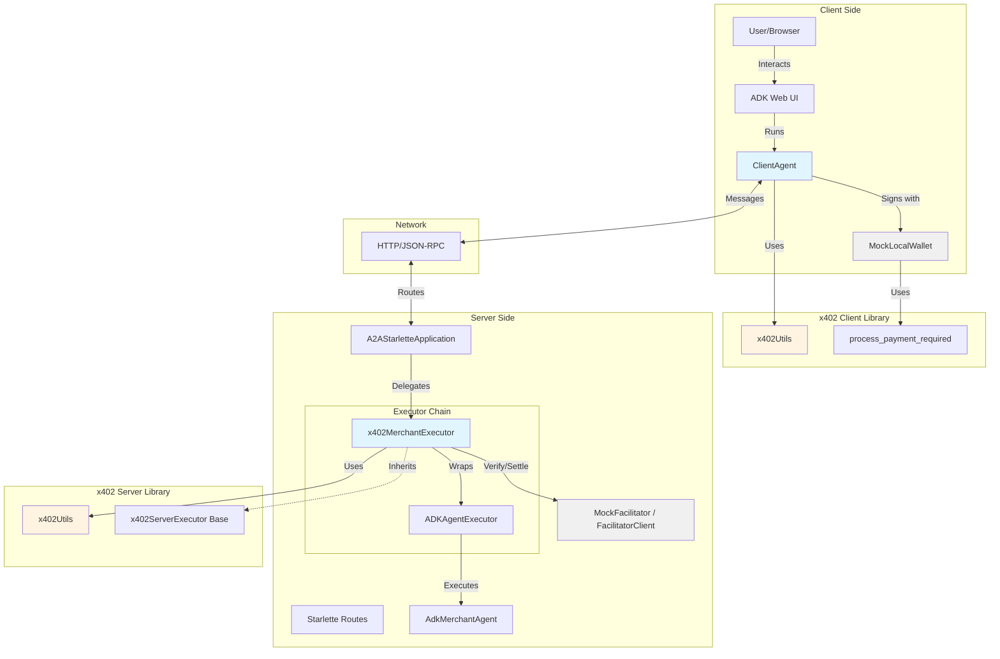
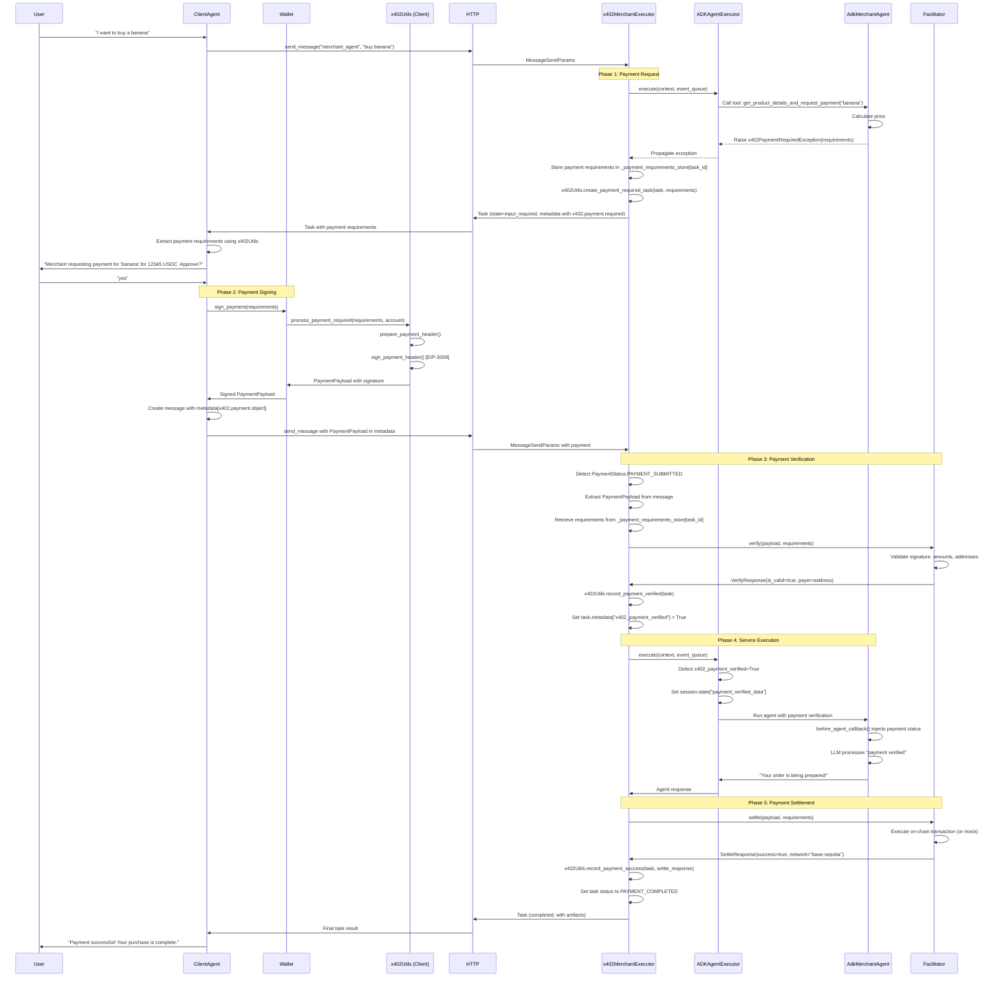
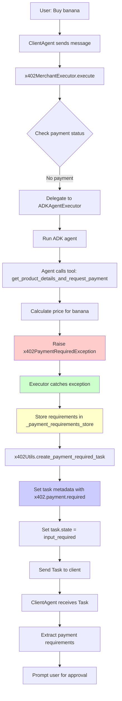
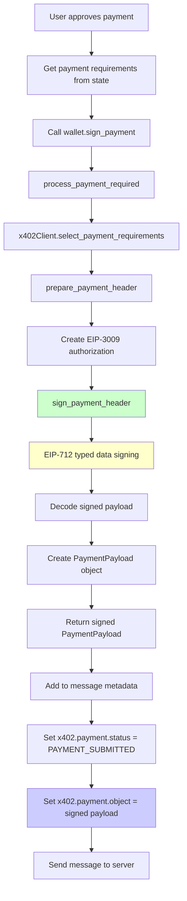
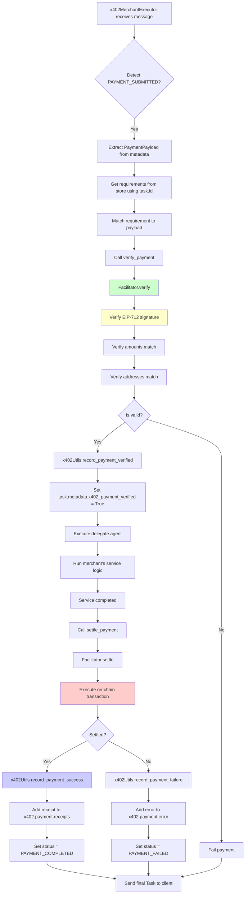
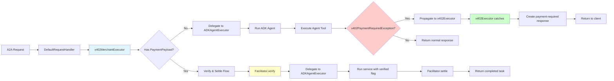

# ADK x402 Payment Protocol Demo - Architecture Documentation

## Table of Contents

1. [Overview](#overview)
2. [System Architecture](#system-architecture)
3. [Component Overview](#component-overview)
4. [Complete Payment Flow](#complete-payment-flow)
5. [x402_a2a Library Methods Reference](#x402_a2a-library-methods-reference)
6. [Detailed Flow Diagrams](#detailed-flow-diagrams)
7. [Key Design Patterns](#key-design-patterns)
8. [Pluggable Components](#pluggable-components)

---

## Overview

This demo implements a complete end-to-end payment flow between two AI agents using the **A2A x402 Payment Protocol Extension**. The system demonstrates how agents can autonomously negotiate and execute payments for services.

### Core Concept

The x402 protocol enables payment-gated services through a standardized exception-based pattern:

1. **Merchant Agent** requests payment by raising `x402PaymentRequiredException`
2. **x402ServerExecutor** intercepts the exception and creates a payment request
3. **Client Agent** receives payment requirements and prompts user for approval
4. **Wallet** signs the payment authorization using EIP-3009
5. **Server** verifies and settles the payment through a **Facilitator**
6. **Service** is executed and results are returned to the client

---

## System Architecture



---

## Component Overview

### Client-Side Components

#### 1. **ClientAgent** (`client_agent/client_agent.py`)

The orchestrator agent that manages user interaction and delegates tasks to remote agents.

**Key Responsibilities:**

- Discover available remote agents
- Send messages to merchant agents
- Handle payment-required responses
- Prompt user for payment approval
- Coordinate wallet signing
- Report final outcomes

**Key Methods:**

- `list_remote_agents()` - Lists available agents
- `send_message(agent_name, message, tool_context)` - Sends messages and handles payment flows

#### 2. **Wallet Interface** (`client_agent/wallet.py`)

Abstract interface for payment signing, allowing different wallet implementations.

**Key Implementations:**

- `MockLocalWallet` - Demo wallet with hardcoded private key (NOT for production)
- Future: MetaMask integration, MPC services, hardware wallets

#### 3. **RemoteAgentConnections** (`client_agent/_remote_agent_connection.py`)

Manages HTTP connections to remote A2A agents.

### Server-Side Components

#### 4. **AdkMerchantAgent** (`server/agents/adk_merchant_agent.py`)

The merchant's business logic agent, responsible for product information and payment requests.

**Key Responsibilities:**

- Provide product details and pricing
- Raise `x402PaymentRequiredException` when payment is needed
- Process verified payments
- Return service results

**Key Methods:**

- `get_product_details_and_request_payment(product_name)` - Tool that requests payment
- `before_agent_callback(callback_context)` - Injects payment verification status

#### 5. **x402MerchantExecutor** (`server/agents/x402_merchant_executor.py`)

Concrete implementation of the x402 server-side protocol handler.

**Key Responsibilities:**

- Intercept `x402PaymentRequiredException`
- Create payment-required responses
- Verify payments with facilitator
- Settle payments
- Record payment status

**Key Methods:**

- `verify_payment(payload, requirements)` - Verify payment with facilitator
- `settle_payment(payload, requirements)` - Settle payment with facilitator

#### 6. **ADKAgentExecutor** (`server/agents/_adk_agent_executor.py`)

Bridges the ADK (Google Agent Development Kit) with the A2A protocol.

**Key Responsibilities:**

- Execute ADK agent tools
- Convert between A2A and GenAI types
- Handle multi-turn agent conversations
- Propagate `x402PaymentRequiredException` to wrapper

#### 7. **MockFacilitator** (`server/agents/mock_facilitator.py`)

Testing facilitator that approves all valid transactions without blockchain interaction.

**Production Alternative:**

- `FacilitatorClient` - Real facilitator for on-chain settlement

---

## Complete Payment Flow



---

## x402_a2a Library Methods Reference

### Core Utility Class: `x402Utils`

Located in: `x402_a2a/core/utils.py`

The `x402Utils` class provides state management for the x402 protocol across A2A tasks and messages.

#### Metadata Keys

```python
STATUS_KEY = "x402.payment.status"
REQUIRED_KEY = "x402.payment.required"
PAYLOAD_KEY = "x402.payment.object"
RECEIPTS_KEY = "x402.payment.receipts"
ERROR_KEY = "x402.payment.error"
```

#### Payment Status Methods

##### `get_payment_status(task: Task) -> Optional[PaymentStatus]`

Extracts the current payment status from a task's metadata.

**Returns:**

- `PaymentStatus.PAYMENT_REQUIRED` - Payment is needed
- `PaymentStatus.PAYMENT_SUBMITTED` - Client sent payment
- `PaymentStatus.PAYMENT_VERIFIED` - Payment verified
- `PaymentStatus.PAYMENT_COMPLETED` - Payment settled successfully
- `PaymentStatus.PAYMENT_FAILED` - Payment failed
- `None` - No payment status found

**Usage Example:**

```python
utils = x402Utils()
status = utils.get_payment_status(task)
if status == PaymentStatus.PAYMENT_SUBMITTED:
    # Process payment
```

##### `get_payment_status_from_message(message: Message) -> Optional[PaymentStatus]`

Extracts payment status directly from a message.

##### `get_payment_status_from_task(task: Task) -> Optional[PaymentStatus]`

Extracts payment status from task's status message metadata.

#### Payment Requirements Methods

##### `get_payment_requirements(task: Task) -> Optional[x402PaymentRequiredResponse]`

Extracts payment requirements from a task. These requirements contain the `accepts` array with payment options.

**Returns:** `x402PaymentRequiredResponse` object containing:

- `x402_version`: Protocol version
- `accepts`: List of `PaymentRequirements` objects
- `error`: Error message (optional)

**Usage Example:**

```python
requirements = utils.get_payment_requirements(task)
if requirements:
    for option in requirements.accepts:
        print(f"Network: {option.network}, Amount: {option.max_amount_required}")
```

##### `get_payment_requirements_from_message(message: Message) -> Optional[x402PaymentRequiredResponse]`

Extracts payment requirements directly from a message.

#### Payment Payload Methods

##### `get_payment_payload(task: Task) -> Optional[PaymentPayload]`

Extracts the signed payment payload from a task.

**Returns:** `PaymentPayload` object containing:

- `x402_version`: Protocol version
- `scheme`: Payment scheme (e.g., "exact")
- `network`: Blockchain network
- `payload`: Scheme-specific payload (e.g., `ExactPaymentPayload` with EIP-3009 authorization)

**Usage Example:**

```python
payload = utils.get_payment_payload(task)
if payload and isinstance(payload.payload, ExactPaymentPayload):
    auth = payload.payload.authorization
    print(f"From: {auth.from_}, Amount: {auth.value}")
```

##### `get_payment_payload_from_message(message: Message) -> Optional[PaymentPayload]`

Extracts payment payload directly from a message.

#### Task State Management Methods

##### `create_payment_required_task(task: Task, payment_required: x402PaymentRequiredResponse) -> Task`

Updates a task to indicate payment is required.

**Actions:**

- Sets task state to `TaskState.input_required`
- Adds payment requirements to metadata
- Sets payment status to `PAYMENT_REQUIRED`

**Usage Example:**

```python
payment_required = x402PaymentRequiredResponse(
    x402_version=1,
    accepts=[requirements],
    error="Payment required for banana"
)
task = utils.create_payment_required_task(task, payment_required)
# Task is now ready to be sent to client
```

##### `record_payment_verified(task: Task) -> Task`

Records that payment has been verified.

**Actions:**

- Sets payment status to `PAYMENT_VERIFIED`
- Maintains task state

##### `record_payment_success(task: Task, settle_response: SettleResponse) -> Task`

Records successful payment settlement.

**Actions:**

- Sets payment status to `PAYMENT_COMPLETED`
- Appends settlement receipt to `x402.payment.receipts` array
- Cleans up intermediate payment data

**Usage Example:**

```python
settle_response = SettleResponse(
    success=True,
    network="base-sepolia",
    transaction_hash="0x123..."
)
task = utils.record_payment_success(task, settle_response)
```

##### `record_payment_failure(task: Task, error_code: str, settle_response: SettleResponse) -> Task`

Records payment failure.

**Actions:**

- Sets payment status to `PAYMENT_FAILED`
- Records error code in metadata
- Appends failure receipt

#### Receipt Methods

##### `get_payment_receipts(task: Task) -> list[SettleResponse]`

Gets all payment receipts from a task.

##### `get_latest_receipt(task: Task) -> Optional[SettleResponse]`

Gets the most recent payment receipt.

### Wallet Functions

Located in: `x402_a2a/core/wallet.py`

##### `process_payment_required(payment_required: x402PaymentRequiredResponse, account: Account, max_value: Optional[int] = None) -> PaymentPayload`

Processes a complete payment-required response and creates a signed payment payload.

**Parameters:**

- `payment_required`: The complete response from merchant with `accepts[]` array
- `account`: Ethereum account (from `eth_account`) for signing
- `max_value`: Maximum payment value willing to pay (optional)

**Returns:** `PaymentPayload` - Fully signed payment ready to send

**Process:**

1. Uses `x402Client` to select best payment requirement from `accepts` array
2. Calls `process_payment()` to sign the selected requirement
3. Returns signed payload

**Usage Example:**

```python
from eth_account import Account
from x402_a2a import process_payment_required

account = Account.from_key(private_key)
signed_payload = process_payment_required(payment_required, account)
# signed_payload is ready to send to merchant
```

##### `process_payment(requirements: PaymentRequirements, account: Account, max_value: Optional[int] = None) -> PaymentPayload`

Creates a signed `PaymentPayload` for a single payment requirement using EIP-3009 signing.

**Parameters:**

- `requirements`: Single `PaymentRequirements` object to sign
- `account`: Ethereum account for signing
- `max_value`: Maximum payment value (optional)

**Returns:** `PaymentPayload` with signature

**Process:**

1. Prepares unsigned payment header with authorization details
2. Signs using EIP-712 typed data signing (EIP-3009)
3. Constructs `PaymentPayload` with `ExactPaymentPayload` containing:
   - `signature`: EIP-712 signature
   - `authorization`: EIP-3009 authorization with from, to, value, nonce, validity window

### Extension Functions

Located in: `x402_a2a/types/` and `x402_a2a/extension.py`

##### `get_extension_declaration(description: str, required: bool) -> dict`

Creates an extension declaration for an agent card.

**Usage Example:**

```python
from x402_a2a import get_extension_declaration

capabilities = AgentCapabilities(
    streaming=False,
    extensions=[
        get_extension_declaration(
            description="Supports payments using the x402 protocol.",
            required=True
        )
    ]
)
```

### Exception Classes

##### `x402PaymentRequiredException`

Located in: `x402_a2a/types/errors.py`

Exception raised by merchant agents to signal payment is required.

**Constructor:**

```python
x402PaymentRequiredException(
    resource_name: str,
    requirements: PaymentRequirements | List[PaymentRequirements]
)
```

**Methods:**

- `get_accepts_array() -> List[PaymentRequirements]` - Returns payment requirements as list

**Usage Example:**

```python
from x402_a2a import x402PaymentRequiredException, PaymentRequirements

requirements = PaymentRequirements(
    scheme="exact",
    network="base-sepolia",
    asset="0x036CbD53842c5426634e7929541eC2318f3dCF7e",
    pay_to="0xAb5801a7D398351b8bE11C439e05C5B3259aeC9B",
    max_amount_required="100000",
    description="Payment for: banana",
)

raise x402PaymentRequiredException("banana", requirements)
```

### Server Executor

##### `x402ServerExecutor` (Abstract Base Class)

Located in: `x402_a2a/executors/server.py`

Server-side middleware that wraps an `AgentExecutor` to handle the x402 payment protocol.

**Abstract Methods to Implement:**

```python
async def verify_payment(
    self,
    payload: PaymentPayload,
    requirements: PaymentRequirements
) -> VerifyResponse:
    """Verify payment with facilitator"""

async def settle_payment(
    self,
    payload: PaymentPayload,
    requirements: PaymentRequirements
) -> SettleResponse:
    """Settle payment with facilitator"""
```

**Key Features:**

- Automatically intercepts `x402PaymentRequiredException`
- Manages payment state across request cycles
- Stores payment requirements for verification
- Coordinates verify → execute → settle flow

**Usage Example:**

```python
from x402_a2a.executors import x402ServerExecutor
from x402_a2a import FacilitatorClient, x402ExtensionConfig

class MyMerchantExecutor(x402ServerExecutor):
    def __init__(self, delegate: AgentExecutor):
        super().__init__(delegate, x402ExtensionConfig())
        self._facilitator = FacilitatorClient(facilitator_config)

    async def verify_payment(self, payload, requirements):
        return await self._facilitator.verify(payload, requirements)

    async def settle_payment(self, payload, requirements):
        return await self._facilitator.settle(payload, requirements)
```

### Facilitator Client

##### `FacilitatorClient`

Located in: `x402/facilitator/` (from x402 base library)

Handles on-chain payment verification and settlement.

**Methods:**

- `verify(payload: PaymentPayload, requirements: PaymentRequirements) -> VerifyResponse`
- `settle(payload: PaymentPayload, requirements: PaymentRequirements) -> SettleResponse`

---

## Detailed Flow Diagrams

### Phase 1: Payment Request Flow



### Phase 2: Payment Signing Flow



### Phase 3: Payment Verification & Settlement Flow



### Executor Chain Flow



---

## Key Design Patterns

### 1. Exception-Based Payment Request Pattern

Instead of returning payment requirements directly from tools, agents raise an exception:

```python
# ❌ Old approach - requires mixing business logic with protocol
def get_product(product_name: str) -> dict:
    price = calculate_price(product_name)
    return {
        "x402_payment_required": {
            "accepts": [...]
        }
    }

# ✅ New approach - clean separation
def get_product(product_name: str) -> dict:
    price = calculate_price(product_name)
    requirements = PaymentRequirements(...)
    raise x402PaymentRequiredException(product_name, requirements)
```

**Benefits:**

- Business logic stays pure
- Protocol handling is delegated to middleware
- Easy to add payment gates to existing functions

### 2. Executor Wrapper Pattern

The x402 protocol is implemented as executor wrappers that intercept requests:

```python
# Layer 1: Base agent executor (business logic)
agent_executor = ADKAgentExecutor(runner, agent_card)

# Layer 2: x402 protocol wrapper (payment handling)
agent_executor = x402MerchantExecutor(agent_executor)

# Layer 3: Request handler (A2A protocol)
request_handler = DefaultRequestHandler(
    agent_executor=agent_executor,
    task_store=InMemoryTaskStore()
)
```

**Benefits:**

- Separation of concerns
- Protocol logic is reusable
- Easy to add/remove features
- Business logic doesn't know about payments

### 3. State Injection Pattern

Payment verification status is injected into the agent's callback:

```python
# In ADKAgentExecutor
if context.current_task.metadata.get("x402_payment_verified"):
    session.state["payment_verified_data"] = {
        "product": product_name,
        "status": "SUCCESS"
    }

# In AdkMerchantAgent
def before_agent_callback(self, callback_context):
    payment_data = callback_context.state.get("payment_verified_data")
    if payment_data:
        # Inject virtual tool response
        tool_response = types.Part(
            function_response=types.FunctionResponse(
                name="check_payment_status",
                response=payment_data
            )
        )
        callback_context.new_user_message = types.Content(parts=[tool_response])
```

**Benefits:**

- Agent doesn't need payment-specific tools
- Natural LLM integration
- Maintains agent's conversation flow

### 4. Pluggable Component Pattern

Both wallet and facilitator are interfaces with swappable implementations:

```python
# Demo mode
wallet = MockLocalWallet()
facilitator = MockFacilitator()

# Production mode
wallet = MetaMaskWallet()
facilitator = FacilitatorClient(config)

# The agent code doesn't change
```

---

## Pluggable Components

### Wallet Implementations

The `Wallet` interface (`client_agent/wallet.py`) allows different signing backends:

#### Current: MockLocalWallet

```python
class MockLocalWallet(Wallet):
    def sign_payment(self, requirements):
        # Uses hardcoded private key
        account = Account.from_key("0x00...01")
        return process_payment_required(requirements, account)
```

#### Future: MetaMask Integration

```python
class MetaMaskWallet(Wallet):
    async def sign_payment(self, requirements):
        # Request signature from browser extension
        signature = await self.metamask.request({
            "method": "eth_signTypedData_v4",
            "params": [account, typed_data]
        })
        return PaymentPayload(...)
```

#### Future: MPC Wallet

```python
class MPCWallet(Wallet):
    async def sign_payment(self, requirements):
        # Distributed signing via MPC service
        signature = await self.mpc_service.sign(
            message=message,
            keyshare_id=self.keyshare_id
        )
        return PaymentPayload(...)
```

### Facilitator Implementations

The `FacilitatorClient` base class allows different payment processors:

#### Current: MockFacilitator

```python
class MockFacilitator(FacilitatorClient):
    async def verify(self, payload, requirements):
        # Always returns valid for testing
        return VerifyResponse(is_valid=True, payer=address)

    async def settle(self, payload, requirements):
        # No actual blockchain interaction
        return SettleResponse(success=True, network="mock")
```

#### Production: Real Facilitator

```python
facilitator = FacilitatorClient(FacilitatorConfig(
    api_url="https://facilitator.example.com",
    api_key="your-api-key",
    network="base-sepolia"
))

# Handles real on-chain verification and settlement
```

To switch between implementations, set environment variable:

```bash
# Use mock (default)
export USE_MOCK_FACILITATOR=true

# Use real facilitator
export USE_MOCK_FACILITATOR=false
```

---

## Summary

This architecture demonstrates a clean, modular approach to implementing payment-gated AI services:

1. **Business logic** remains pure and focused (AdkMerchantAgent)
2. **Protocol handling** is delegated to middleware (x402ServerExecutor)
3. **Payment processing** is abstracted behind interfaces (Wallet, Facilitator)
4. **State management** is handled by utility classes (x402Utils)
5. **Agent frameworks** are bridged through executors (ADKAgentExecutor)

The x402_a2a library provides all the core primitives needed to implement payment protocols while keeping your agent code clean and maintainable.
