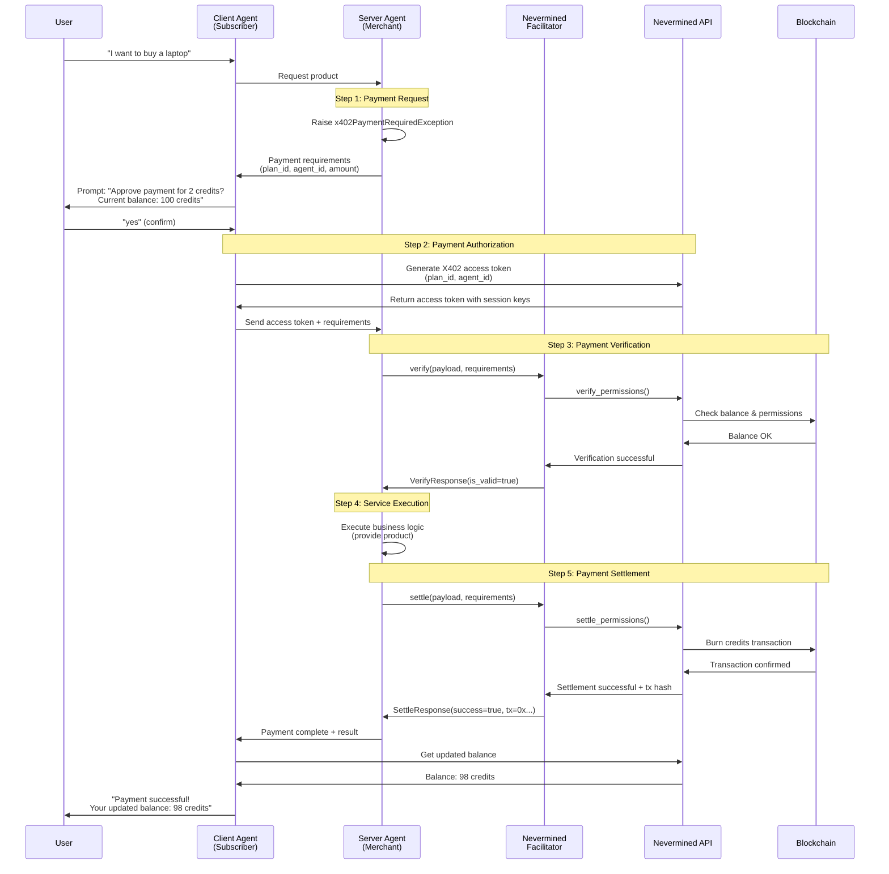

# Nevermined X402 Integration Setup Guide

This guide explains how to use the Nevermined X402 flow for payment verification and settlement in the A2A demo agents.

## Overview

The Nevermined X402 flow enables AI agents to:

1. **Client Agent**: Generate X402 access tokens for payment authorization
2. **Server Agent**: Verify permissions and settle (burn) credits on-chain using the Nevermined network

## Architecture

### Components

1. **NeverminedFacilitator** (`x402_a2a/nvm/facilitator.py`)

   - Implements payment verification and settlement on the blockchain
   - Uses the `payments-py` SDK to interact with Nevermined API
   - Verifies subscriber permissions without burning credits (simulation)
   - Settles payments by burning credits on-chain (real transaction)
   - Part of the `x402_a2a.nvm` package with other Nevermined-specific code

2. **Client Agent** (`client_agent/client_agent.py`)

   - Generates X402 access tokens via Nevermined API
   - Sends tokens to server agents for payment
   - Includes subscriber address in payment requirements

3. **X402 Merchant Executor** (`server/agents/x402_merchant_executor.py`)
   - Always uses Nevermined facilitator for blockchain transactions
   - Extracts payment requirements from message metadata
   - Delegates verification and settlement to Nevermined facilitator

## Setup Instructions

### 1. Install Dependencies

Ensure you have the `payments-py` SDK installed:

```bash
pip install payments-py
```

### 2. Environment Variables

Configure the following environment variables:

#### Server Agent (Merchant)

```bash
# Merchant's API key - for verifying and settling payments
export NVM_API_KEY_SERVER="your-merchant-api-key"
export NVM_ENVIRONMENT="sandbox"  # or "staging" or "production"
```

#### Client Agent (Subscriber)

```bash
# Subscriber's API key - for generating X402 access tokens
export NVM_API_KEY_CLIENT="your-subscriber-api-key"
export NVM_ENVIRONMENT="sandbox"
```

**Important Notes**:

- This demo always uses real blockchain transactions. There is no mock mode.
- **Two separate API keys are required**:
  - `NVM_API_KEY_SERVER`: Merchant's key (server agent) with permissions to verify/settle payments
  - `NVM_API_KEY_CLIENT`: Subscriber's key (client agent) with permissions to generate access tokens
- The keys represent different entities in the payment flow (merchant vs customer)

### 3. Agent Configuration

#### Server Agent

The merchant agent should define payment requirements in the `get_product_details_and_request_payment` method:

```python
requirements = PaymentRequirements(
    plan_id="your-plan-id",
    agent_id="your-agent-id",
    max_amount="2",  # Number of credits to burn
    network="base-sepolia",  # or other supported networks
    scheme="contract",
    extra=None
)

raise x402PaymentRequiredException(product_name, requirements)
```

#### Client Agent

The client agent automatically:

1. Retrieves subscriber address from the NVM API key
2. Generates X402 access token for the specified plan and agent
3. Sends the token and requirements to the server agent

## Payment Flow



### Step 1: Payment Request

1. User requests to buy something from the merchant agent
2. Merchant agent raises `x402PaymentRequiredException` with payment requirements
3. Client agent receives requirements and prompts user for confirmation

### Step 2: Payment Authorization

1. User confirms payment
2. Client agent calls `payments.x402.get_x402_access_token(plan_id, agent_id)`
3. Nevermined API generates X402 access token with session keys
4. Client agent sends token + requirements to server agent

### Step 3: Payment Verification

1. Server agent extracts X402 token and requirements from message metadata
2. NeverminedFacilitator calls `payments.facilitator.verify_permissions()`
3. Nevermined API:
   - Validates the X402 access token
   - Checks subscriber's credit balance
   - Simulates credit burn to ensure sufficient permissions
4. Returns verification result

### Step 4: Service Execution

1. If verification succeeds, server agent executes the service
2. Business logic runs (e.g., providing the product)

### Step 5: Payment Settlement

1. Server agent calls NeverminedFacilitator for settlement
2. NeverminedFacilitator calls `payments.facilitator.settle_permissions()`
3. Nevermined API:
   - Orders more credits if balance is insufficient
   - Burns the specified credits on-chain
   - Returns transaction hash
4. Payment is complete

## API Reference

### NeverminedFacilitator

Located in: `x402_a2a/nvm/facilitator.py`

```python
from payments_py.x402 import NeverminedFacilitator

class NeverminedFacilitator(FacilitatorClient):
    def __init__(
        self,
        nvm_api_key: str,
        environment: str = "sandbox",
    )

    async def verify(
        self,
        payload: PaymentPayload,
        requirements: PaymentRequirements
    ) -> VerifyResponse

    async def settle(
        self,
        payload: PaymentPayload,
        requirements: PaymentRequirements
    ) -> SettleResponse
```

### Payment Requirements Structure

```python
PaymentRequirements(
    plan_id: str,          # Payment plan ID from Nevermined
    agent_id: str,         # AI agent ID from Nevermined
    max_amount: str,       # Number of credits to burn (as string)
    network: str,          # Blockchain network (e.g., "base-sepolia")
    scheme: str,           # Payment scheme (e.g., "contract")
    extra: dict = {        # Additional metadata
        "subscriber_address": "0x..."  # Subscriber's wallet address
    }
)
```

### Payment Payload Structure

```python
PaymentPayload(
    nvm_version: int,              # Protocol version (1)
    scheme: str,                   # Payment scheme
    network: str,                  # Blockchain network
    payload: SessionKeyPayload(
        session_key: str          # X402 access token
    )
)
```

## Testing

This demo always uses real blockchain transactions via the Nevermined network.

### Testing Environment

Use the `sandbox` environment for development:

```bash
export NVM_ENVIRONMENT="sandbox"
export NVM_API_KEY="your-sandbox-api-key"
```

## Example Usage

See the existing demo agents for complete examples:

- **Client Agent**: `client_agent/client_agent.py`
- **Server Agent**: `server/agents/adk_merchant_agent.py`
- **Executor**: `server/agents/x402_merchant_executor.py`
- **Facilitator**: `x402_a2a/nvm/facilitator.py`

## Additional Resources

- [Nevermined Documentation](https://docs.nevermined.app/)
- [X402 Protocol Specification](https://github.com/coinbase/x402)
- [Payments-py SDK](https://github.com/nevermined-io/payments-py)
