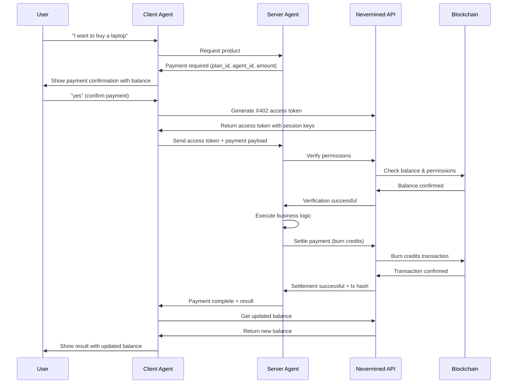
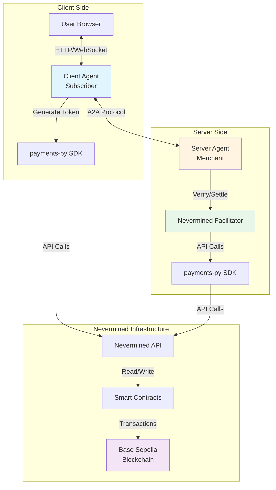

# Quick Start: Nevermined X402 Demo

This guide shows you how to quickly run the A2A demo with Nevermined X402 payment integration.

## Prerequisites

1. **Nevermined Account**

   - Sign up at [Nevermined](https://nevermined.app/)
   - Get your NVM API keys from [https://nevermined.app/api-keys](https://nevermined.app/api-keys)
   - Note: The API key format is `nvm:JWT_TOKEN`
   - You'll need two API keys: one for the merchant (server) and one for the subscriber (client)

2. **Payment Plan & Agent**

   - Create a payment plan on Nevermined
   - Register an AI agent associated with the plan
   - Note the `plan_id` and `agent_id`

3. **Python Environment**
   - Python 3.11 or higher
   - Install dependencies: `pip install -r requirements.txt`

## Step 1: Configure Environment Variables

Copy `.env.sample` to `.env` in the demo directory:

```bash
cp python/examples/adk-demo/.env.sample python/examples/adk-demo/.env
```

Then edit the `.env` file with your configuration:

```bash
# Server Agent (Merchant) - API key for the service provider
NVM_API_KEY_SERVER="nvm:your-merchant-jwt-token-here"

# Client Agent (Subscriber) - API key for the customer
NVM_API_KEY_CLIENT="nvm:your-subscriber-jwt-token-here"

# Nevermined environment
NVM_ENVIRONMENT="sandbox"

# Google ADK (if needed)
GOOGLE_GENAI_API_KEY="your-google-api-key"
```

Or export them directly:

```bash
export NVM_API_KEY_SERVER="nvm:your-merchant-jwt-token"
export NVM_API_KEY_CLIENT="nvm:your-subscriber-jwt-token"
export NVM_ENVIRONMENT="sandbox"
```

**Important Notes**:

- This demo always uses real blockchain transactions via the Nevermined network
- **Server uses `NVM_API_KEY_SERVER`**: Merchant's key for verifying and settling payments
- **Client uses `NVM_API_KEY_CLIENT`**: Subscriber's key for generating X402 access tokens
- Both represent different entities in the payment flow

## Step 2: Configure Payment Plan Details

Add your Nevermined plan and agent IDs to the `.env` file:

```bash
# Payment Plan Configuration
NVM_PLAN_ID="your-plan-id-from-nevermined"
NVM_AGENT_ID="your-agent-id-from-nevermined"
NVM_PAYMENT_AMOUNT="2"  # Credits per transaction
NVM_NETWORK="base-sepolia"  # Blockchain network
```

These values will be automatically loaded by the merchant agent.

## Step 3: Install Dependencies

From the **root of the repository**, run:

```bash
uv sync --directory=python/examples/adk-demo
```

This will install all required dependencies for the demo.

## Step 4: Start the Server Agent (Merchant)

From the **root of the repository**, in one terminal:

```bash
uv --directory=python/examples/adk-demo run server
```

You should see:

```
--- Initializing Nevermined Facilitator ---
✅ Nevermined Facilitator initialized for 'sandbox' environment
Initialized NeverminedFacilitator for environment: sandbox
Server listening on http://localhost:10000
```

## Step 5: Start the Client Agent

From the **root of the repository**, in another terminal:

```bash
uv --directory=python/examples/adk-demo run adk web --port=8000
```

The web interface will be available at: http://localhost:8000

## Step 6: Test the Payment Flow

### Example Conversation

1. Open your browser to http://localhost:8000
2. Start a conversation with the client agent

**User**: "List available agents"

**Client Agent**: Shows available agents including the merchant

**User**: "I want to buy a laptop from the merchant"

**Client Agent**: Sends request to merchant agent

**Merchant Agent**: Returns payment requirements

```
The merchant is requesting payment for agent YOUR_AGENT_ID
with plan YOUR_PLAN_ID for 2 credits.
Your current balance: 100 credits.
Do you want to approve this payment?
```

**User**: "yes"

**Client Agent**:

1. ✅ Generates X402 access token from Nevermined
2. Sends token to merchant agent

**Server Agent**:

1. ✅ Verifies permissions with Nevermined (on-chain check)
2. ✅ Executes merchant logic (provides product)
3. ✅ Settles payment (burns credits on blockchain)
4. Returns confirmation with transaction hash

**Result**:

```
Your order for the laptop is being prepared. Thank you for your purchase!
Your updated balance: 98 credits.
```

### Payment Flow Diagram



## Example Session Log

### Architecture Overview



### Session Log Example

```
[Client] User: List available agents
[Client] Agent: Available agents:
  - x402 Merchant Agent: Sells items using x402 protocol

[Client] User: Buy a laptop
[Client] → Merchant: "I want to buy a laptop"

[Merchant] Requesting payment:
  - Plan: 85917684554499762134516240562181895926019634254204202319880150802501990701934
  - Agent: 80918427023170428029540261117198154464497879145267720259488529685089104529015
  - Amount: 2 credits
  - Network: base-sepolia

[Client] ✅ Generated X402 access token
[Client] Subscriber: 0x9dDD02D4E111ab5cE47511987B2500fcB56252c6
[Client] → Merchant: Sending payment payload

[Merchant] === NEVERMINED FACILITATOR: VERIFY ===
[Merchant] Verifying permissions for plan: 85917684...
[Merchant] ✅ Payment Verified on Blockchain!

[Merchant] Executing business logic...
[Merchant] Providing product: laptop

[Merchant] === NEVERMINED FACILITATOR: SETTLE ===
[Merchant] Settling permissions for plan: 85917684...
[Merchant] ✅ Payment Settled on Blockchain! Tx: 0x004e48bd...
[Merchant] ✅ Payment settled successfully! Credits burned: 2

[Client] ✅ Payment successful! Your purchase is complete.
[Client] Your updated balance: 98 credits.
```

## Next Steps

1. **Monitor Usage**: Check Nevermined dashboard for credit usage
2. **Add Products**: Extend merchant agent with more products
3. **Custom Plans**: Create different payment plans for different service tiers
4. **Error Handling**: Add retry logic and error notifications
5. **Analytics**: Track payment success rates and user behavior

## Resources

- [Nevermined Documentation](https://docs.nevermined.app/)
- [Payments-py SDK Docs](https://github.com/nevermined-io/payments-py)
- [X402 Protocol](https://github.com/coinbase/x402)
- [A2A Protocol](https://github.com/google/a2a)

## Support

- **Nevermined**: support@nevermined.io
- **Documentation**: `NEVERMINED_X402_SETUP.md`
- **Implementation Details**: `IMPLEMENTATION_SUMMARY.md`
