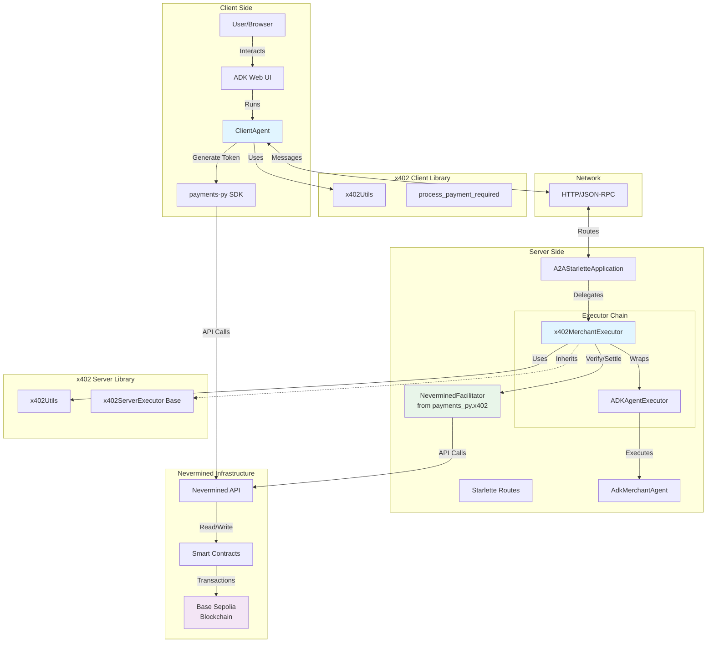
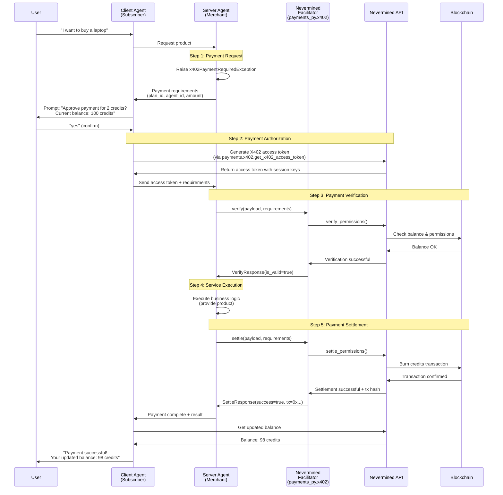

# ADK x402 Payment Protocol Demo with Nevermined

This project demonstrates a complete, end-to-end payment flow between two agents using the **A2A x402 Payment Protocol Extension** with **Nevermined** payment integration. It serves as a reference implementation for developers looking to add payment capabilities to their own agents.

> **🎯 This is the Nevermined Demo**: This demo showcases real blockchain payments using Nevermined's payment infrastructure. It uses actual on-chain transactions for payment verification and settlement, making it a production-ready example of x402 payments in action.

## What This Demo Shows

This demo demonstrates:

- ✅ **Real Blockchain Payments**: Uses Nevermined's payment network for actual on-chain credit verification and settlement
- ✅ **X402 Access Tokens**: Generates and validates X402 access tokens for payment authorization
- ✅ **Agent-to-Agent Commerce**: Complete payment flow between client and merchant agents using the A2A protocol
- ✅ **Production-Ready Integration**: Uses the `payments_py` SDK for payment processing

## Demo Components

The demo consists of two main components:

1. A **Client Agent** that acts as an orchestrator, delegating tasks and handling the user-facing interaction.
2. A **Merchant Server** that hosts a specialized agent capable of selling items and processing payments using the x402 protocol.

## Technology Stack

The reusable, core logic for the x402 protocol is encapsulated in:

- The `x402_a2a` Python library (located in the `python/` directory of the parent repository) - provides A2A protocol integration
- The `payments_py` SDK - provides Nevermined payment facilitator and X402 token generation

## Table of Contents

1. [Quick Start](#quick-start)
2. [Prerequisites](#prerequisites)
3. [Setup Instructions](#setup-instructions)
4. [Running the Demo](#running-the-demo)
5. [Architecture Overview](#architecture-overview)
6. [Payment Flow](#payment-flow)
7. [Component Details](#component-details)
8. [API Reference](#api-reference)
9. [Design Patterns](#design-patterns)
10. [Resources](#resources)

---

## Quick Start

### Prerequisites

1. **Nevermined Account**

   - Sign up at [Nevermined](https://nevermined.app/)
   - Get your NVM API keys from [https://nevermined.app/api-keys](https://nevermined.app/api-keys)
   - Note: The API key format is `nvm:JWT_TOKEN`
   - You'll need two API keys: one for the merchant (server) and one for the subscriber (client)

2. **Payment Plan & Agent**

   - Create a payment plan on Nevermined
   - Register an AI agent associated with the plan
   - Note the `plan_id` and `agent_id`

3. **Python Environment**
   - Python 3.11 or higher
   - `uv` (for environment and package management)
   - Google API key (you can create one [here](https://ai.google.dev/gemini-api/docs/api-key))

### Setup

1. **Install Dependencies**

   From the root of the `a2a-x402` repository:

   ```bash
   uv sync --directory=python/examples/adk-demo
   ```

2. **Configure Environment Variables**

   Copy `.env.sample` to `.env` in the demo directory:

   ```bash
   cp python/examples/adk-demo/.env.sample python/examples/adk-demo/.env
   ```

   Then edit the `.env` file with your configuration:

   ```bash
   # Server Agent (Merchant) - API key for the service provider
   NVM_API_KEY_SERVER="nvm:your-merchant-jwt-token-here"

   # Client Agent (Subscriber) - API key for the customer
   NVM_API_KEY_CLIENT="nvm:your-subscriber-jwt-token-here"

   # Nevermined environment
   NVM_ENVIRONMENT="sandbox"

   # Payment Plan Configuration
   NVM_PLAN_ID="your-plan-id-from-nevermined"
   NVM_AGENT_ID="your-agent-id-from-nevermined"
   NVM_PAYMENT_AMOUNT="2"  # Credits per transaction
   NVM_NETWORK="base-sepolia"  # Blockchain network

   # Google ADK
   GOOGLE_GENAI_API_KEY="your-google-api-key"
   ```

   Or export them directly:

   ```bash
   export NVM_API_KEY_SERVER="nvm:your-merchant-jwt-token"
   export NVM_API_KEY_CLIENT="nvm:your-subscriber-jwt-token"
   export NVM_ENVIRONMENT="sandbox"
   export NVM_PLAN_ID="your-plan-id"
   export NVM_AGENT_ID="your-agent-id"
   export NVM_PAYMENT_AMOUNT="2"
   export NVM_NETWORK="base-sepolia"
   export GOOGLE_GENAI_API_KEY="your-google-api-key"
   ```

   **Important Notes**:

   - This demo always uses real blockchain transactions via the Nevermined network
   - **Server uses `NVM_API_KEY_SERVER`**: Merchant's key for verifying and settling payments
   - **Client uses `NVM_API_KEY_CLIENT`**: Subscriber's key for generating X402 access tokens
   - Both represent different entities in the payment flow

3. **Start the Merchant Agent Server**

   From the root of the `a2a-x402` repository, in one terminal:

   ```bash
   uv --directory=python/examples/adk-demo run server
   ```

   You should see:

   ```
   --- Initializing Nevermined Facilitator ---
   ✅ Nevermined Facilitator initialized for 'sandbox' environment
   Server listening on http://localhost:10000
   ```

4. **Start the Client Agent & Web UI**

   From the root of the `a2a-x402` repository, in another terminal:

   ```bash
   uv --directory=python/examples/adk-demo run adk web --port=8000
   ```

   The web interface will be available at: http://localhost:8000

5. **Test the Payment Flow**

   Open your browser to http://localhost:8000 and start a conversation with the client agent:

   **User**: "List available agents"

   **Client Agent**: Shows available agents including the merchant

   **User**: "I want to buy a laptop from the merchant"

   **Client Agent**: Sends request to merchant agent

   **Merchant Agent**: Returns payment requirements

   ```
   The merchant is requesting payment for agent YOUR_AGENT_ID
   with plan YOUR_PLAN_ID for 2 credits.
   Your current balance: 100 credits.
   Do you want to approve this payment?
   ```

   **User**: "yes"

   **Client Agent**:

   - ✅ Generates X402 access token from Nevermined
   - Sends token to merchant agent

   **Server Agent**:

   - ✅ Verifies permissions with Nevermined (on-chain check)
   - ✅ Executes merchant logic (provides product)
   - ✅ Settles payment (burns credits on blockchain)
   - Returns confirmation with transaction hash

   **Result**:

   ```
   Your order for the laptop is being prepared. Thank you for your purchase!
   Your updated balance: 98 credits.
   ```

---

## Prerequisites

### Required Accounts

1. **Nevermined Account**

   - Sign up at [Nevermined](https://nevermined.app/)
   - Get API keys from [https://nevermined.app/api-keys](https://nevermined.app/api-keys)
   - Create a payment plan and register an AI agent

2. **Google API Key**
   - Create one at [https://ai.google.dev/gemini-api/docs/api-key](https://ai.google.dev/gemini-api/docs/api-key)

### Software Requirements

- Python 3.11 or higher
- `uv` package manager
- All dependencies are installed via `uv sync`

---

## Setup Instructions

### 1. Install Dependencies

From the root of the `a2a-x402` repository:

```bash
uv sync --directory=python/examples/adk-demo
```

This installs all required dependencies, including:

- The local `x402_a2a` library (in editable mode)
- The `payments_py` SDK
- Google ADK dependencies

### 2. Configure Environment Variables

Set up your environment variables as described in the [Quick Start](#quick-start) section.

### 3. Configure Payment Plan Details

Add your Nevermined plan and agent IDs to the environment variables. These values will be automatically loaded by the merchant agent.

---

## Running the Demo

### Start the Merchant Server

The merchant server hosts the agent that sells products.

```bash
uv --directory=python/examples/adk-demo run server
```

The server typically runs on `localhost:10000`.

### Start the Client Agent & Web UI

The client agent is an orchestrator that communicates with the merchant. The ADK provides a web interface to interact with it.

```bash
uv --directory=python/examples/adk-demo run adk web --port=8000
```

This starts the ADK web server on `localhost:8000`. Open this URL in your browser to interact with the client agent.

### Try the Payment Demo

Once both servers are running and you've navigated to the web UI, you can test the x402 payment flow by selecting the `client_agent` and asking about purchasing an item such as "I want to buy a banana" or "I want to buy a laptop". The client agent will discover available merchants, request payment details, and guide you through the purchase process.

---

## Architecture Overview

The demo showcases a clean separation of concerns between the agent's business logic and the payment protocol logic.

### System Architecture



### Component Overview

#### Client-Side Components

1. **ClientAgent** (`client_agent/client_agent.py`)

   - The orchestrator agent that manages user interaction and delegates tasks to remote agents
   - **Key Responsibilities:**
     - Discover available remote agents
     - Send messages to merchant agents
     - Handle payment-required responses
     - Prompt user for payment approval
     - Generate X402 access tokens via `payments_py.x402`
     - Report final outcomes
   - **Key Methods:**
     - `list_remote_agents()` - Lists available agents
     - `send_message(agent_name, message, tool_context)` - Sends messages and handles payment flows

2. **Payments SDK Integration**
   - Uses `payments_py.payments.Payments` instance to generate X402 access tokens
   - Calls `payments.x402.get_x402_access_token(plan_id, agent_id)` to create tokens
   - Retrieves subscriber balance information

#### Server-Side Components

1. **AdkMerchantAgent** (`server/agents/adk_merchant_agent.py`)

   - The merchant's business logic agent, responsible for product information and payment requests
   - **Key Responsibilities:**
     - Provide product details and pricing
     - Raise `x402PaymentRequiredException` when payment is needed
     - Process verified payments
     - Return service results
   - **Key Methods:**
     - `get_product_details_and_request_payment(product_name)` - Tool that requests payment
     - `before_agent_callback(callback_context)` - Injects payment verification status

2. **x402MerchantExecutor** (`server/agents/x402_merchant_executor.py`)

   - Concrete implementation of the x402 server-side protocol handler
   - **Key Responsibilities:**
     - Intercept `x402PaymentRequiredException`
     - Create payment-required responses
     - Verify payments with Nevermined facilitator
     - Settle payments on-chain
     - Record payment status
   - **Key Methods:**
     - `verify_payment(payload, requirements)` - Verify payment with facilitator
     - `settle_payment(payload, requirements)` - Settle payment with facilitator
   - **Uses:** `NeverminedFacilitator` from `payments_py.x402`

3. **NeverminedFacilitator** (`payments_py.x402.facilitator`)

   - Implements payment verification and settlement on the blockchain
   - Uses the `payments-py` SDK to interact with Nevermined API
   - Verifies subscriber permissions without burning credits (simulation)
   - Settles payments by burning credits on-chain (real transaction)
   - **Location:** `payments_py.x402.NeverminedFacilitator`

4. **ADKAgentExecutor** (`server/agents/_adk_agent_executor.py`)
   - Bridges the ADK (Google Agent Development Kit) with the A2A protocol
   - **Key Responsibilities:**
     - Execute ADK agent tools
     - Convert between A2A and GenAI types
     - Handle multi-turn agent conversations
     - Propagate `x402PaymentRequiredException` to wrapper

---

## Payment Flow

### Complete Payment Flow Diagram



### Step-by-Step Flow

#### Step 1: Payment Request

1. User requests to buy something from the merchant agent
2. Merchant agent raises `x402PaymentRequiredException` with payment requirements
3. Client agent receives requirements and prompts user for confirmation

#### Step 2: Payment Authorization

1. User confirms payment
2. Client agent calls `payments.x402.get_x402_access_token(plan_id, agent_id)` via the `payments_py` SDK
3. Nevermined API generates X402 access token with session keys
4. Client agent sends token + requirements to server agent

#### Step 3: Payment Verification

1. Server agent extracts X402 token and requirements from message metadata
2. `NeverminedFacilitator` (from `payments_py.x402`) calls `verify(payload, requirements)`
3. Nevermined API:
   - Validates the X402 access token
   - Checks subscriber's credit balance
   - Simulates credit burn to ensure sufficient permissions
4. Returns verification result

#### Step 4: Service Execution

1. If verification succeeds, server agent executes the service
2. Business logic runs (e.g., providing the product)

#### Step 5: Payment Settlement

1. Server agent calls `NeverminedFacilitator.settle(payload, requirements)`
2. Nevermined API:
   - Orders more credits if balance is insufficient
   - Burns the specified credits on-chain
   - Returns transaction hash
3. Payment is complete

### Example Session Log

```
[Client] User: List available agents
[Client] Agent: Available agents:
  - x402 Merchant Agent: Sells items using x402 protocol

[Client] User: Buy a laptop
[Client] → Merchant: "I want to buy a laptop"

[Merchant] Requesting payment:
  - Plan: 85917684554499762134516240562181895926019634254204202319880150802501990701934
  - Agent: 80918427023170428029540261117198154464497879145267720259488529685089104529015
  - Amount: 2 credits
  - Network: base-sepolia

[Client] ✅ Generated X402 access token
[Client] Subscriber: 0x9dDD02D4E111ab5cE47511987B2500fcB56252c6
[Client] → Merchant: Sending payment payload

[Merchant] === NEVERMINED FACILITATOR: VERIFY ===
[Merchant] Verifying permissions for plan: 85917684...
[Merchant] ✅ Payment Verified on Blockchain!

[Merchant] Executing business logic...
[Merchant] Providing product: laptop

[Merchant] === NEVERMINED FACILITATOR: SETTLE ===
[Merchant] Settling permissions for plan: 85917684...
[Merchant] ✅ Payment Settled on Blockchain! Tx: 0x004e48bd...
[Merchant] ✅ Payment settled successfully! Credits burned: 2

[Client] ✅ Payment successful! Your purchase is complete.
[Client] Your updated balance: 98 credits.
```

---

## Component Details

### Architectural Flow

The demo showcases a clean separation of concerns between the agent's business logic and the payment protocol logic.

1. **Merchant-Side (Server):**

   - The `AdkMerchantAgent` contains the core business logic (e.g., providing product details). When payment is required, it doesn't handle any payment logic itself. Instead, it raises a `x402PaymentRequiredException`.
   - The `x402MerchantExecutor` is a wrapper that intercepts this exception. It's responsible for all the server-side protocol logic: creating the `payment-required` response, receiving the client's signed payload, verifying it, and settling it.
   - This executor uses `NeverminedFacilitator` from `payments_py.x402` to handle blockchain transactions.
   - This executor is "injected" in `routes.py`, wrapping the core `ADKAgentExecutor`.

2. **Client-Side (`ClientAgent`):**
   - The `ClientAgent` acts as the user's proxy. Its `send_message` tool handles all communication.
   - When it receives a `payment-required` response from the merchant, it prompts the user for confirmation.
   - Upon user confirmation, it calls `payments.x402.get_x402_access_token()` to generate an X402 access token from Nevermined.
   - It then uses the `X402A2AUtils` from `payments_py.x402` to construct a valid `payment-submitted` message and sends it back to the merchant to finalize the purchase.

### Pluggable Components

A key design goal of this demo is to show how core components can be swapped out with real implementations.

#### Facilitator

The `x402MerchantExecutor` uses the `NeverminedFacilitator` from `payments_py.x402` for all payment verification and settlement. This facilitator:

- Always uses real blockchain transactions via the Nevermined network
- Verifies subscriber permissions without burning credits (simulation)
- Settles payments by burning credits on-chain (real transaction)
- Uses the merchant's API key (`NVM_API_KEY_SERVER`) for authentication

#### Payment Token Generation

The `ClientAgent` uses the `payments_py` SDK to generate X402 access tokens:

- Calls `payments.x402.get_x402_access_token(plan_id, agent_id)` to create tokens
- Uses the subscriber's API key (`NVM_API_KEY_CLIENT`) for authentication
- Retrieves balance information from Nevermined

---

## API Reference

### NeverminedFacilitator

Located in: `payments_py.x402.facilitator`

```python
from payments_py.x402 import NeverminedFacilitator

class NeverminedFacilitator:
    def __init__(
        self,
        nvm_api_key: str,
        environment: str = "sandbox",
    )

    async def verify(
        self,
        payload: PaymentPayload,
        requirements: PaymentRequirements
    ) -> VerifyResponse

    async def settle(
        self,
        payload: PaymentPayload,
        requirements: PaymentRequirements
    ) -> SettleResponse
```

**Example Usage:**

```python
from payments_py.x402 import NeverminedFacilitator, PaymentPayload, PaymentRequirements

# Initialize facilitator
facilitator = NeverminedFacilitator(
    nvm_api_key="nvm:your-api-key",
    environment="sandbox"
)

# Verify payment
verify_result = await facilitator.verify(payment_payload, requirements)

if verify_result.is_valid:
    # Settle payment
    settle_result = await facilitator.settle(payment_payload, requirements)
```

### Payment Requirements Structure

```python
PaymentRequirements(
    plan_id: str,          # Payment plan ID from Nevermined
    agent_id: str,         # AI agent ID from Nevermined
    max_amount: str,       # Number of credits to burn (as string)
    network: str,          # Blockchain network (e.g., "base-sepolia")
    scheme: str,           # Payment scheme (e.g., "contract")
    extra: dict = {        # Additional metadata
        "subscriber_address": "0x..."  # Subscriber's wallet address
    }
)
```

### Payment Payload Structure

```python
PaymentPayload(
    x402_version: int,              # Protocol version (1 or 2)
    scheme: str,                   # Payment scheme
    network: str,                  # Blockchain network
    payload: SessionKeyPayload(
        session_key: str          # X402 access token
    )
)
```

### X402 Token Generation

```python
from payments_py.payments import Payments
from payments_py.common.types import PaymentOptions

# Initialize payments SDK
payments = Payments.get_instance(
    PaymentOptions(
        nvm_api_key="nvm:your-subscriber-key",
        environment="sandbox"
    )
)

# Generate X402 access token
token_response = payments.x402.get_x402_access_token(
    plan_id="your-plan-id",
    agent_id="your-agent-id"
)
access_token = token_response["accessToken"]
```

### x402_a2a Library Methods Reference

#### Core Utility Class: `X402A2AUtils`

Located in: `payments_py.x402.a2a`

The `X402A2AUtils` class provides state management for the x402 protocol across A2A tasks and messages.

**Key Methods:**

- `get_payment_status(task: Task) -> Optional[PaymentStatus]` - Extracts payment status from task metadata
- `get_payment_requirements(task: Task) -> Optional[x402PaymentRequiredResponse]` - Extracts payment requirements
- `get_payment_payload(task: Task) -> Optional[PaymentPayload]` - Extracts signed payment payload
- `create_payment_required_task(task: Task, payment_required: x402PaymentRequiredResponse) -> Task` - Updates task to indicate payment required
- `record_payment_verified(task: Task) -> Task` - Records payment verification
- `record_payment_success(task: Task, settle_response: SettleResponse) -> Task` - Records successful settlement

#### Exception Classes

##### `x402PaymentRequiredException`

Located in: `x402_a2a.types.errors`

Exception raised by merchant agents to signal payment is required.

```python
from x402_a2a import x402PaymentRequiredException, PaymentRequirements

requirements = PaymentRequirements(
    plan_id="your-plan-id",
    agent_id="your-agent-id",
    max_amount="2",
    network="base-sepolia",
    scheme="contract",
)

raise x402PaymentRequiredException("product_name", requirements)
```

#### Server Executor

##### `x402ServerExecutor` (Abstract Base Class)

Located in: `x402_a2a.executors.server`

Server-side middleware that wraps an `AgentExecutor` to handle the x402 payment protocol.

**Abstract Methods to Implement:**

```python
async def verify_payment(
    self,
    payload: PaymentPayload,
    requirements: PaymentRequirements
) -> VerifyResponse:
    """Verify payment with facilitator"""

async def settle_payment(
    self,
    payload: PaymentPayload,
    requirements: PaymentRequirements
) -> SettleResponse:
    """Settle payment with facilitator"""
```

**Usage Example:**

```python
from x402_a2a.executors import x402ServerExecutor
from x402_a2a import x402ExtensionConfig
from payments_py.x402 import NeverminedFacilitator

class MyMerchantExecutor(x402ServerExecutor):
    def __init__(self, delegate: AgentExecutor):
        super().__init__(delegate, x402ExtensionConfig())
        self._facilitator = NeverminedFacilitator(
            nvm_api_key=os.getenv("NVM_API_KEY_SERVER"),
            environment=os.getenv("NVM_ENVIRONMENT", "sandbox")
        )

    async def verify_payment(self, payload, requirements):
        return await self._facilitator.verify(payload, requirements)

    async def settle_payment(self, payload, requirements):
        return await self._facilitator.settle(payload, requirements)
```

---

## Design Patterns

### 1. Exception-Based Payment Request Pattern

Instead of returning payment requirements directly from tools, agents raise an exception:

```python
# ✅ Clean separation approach
def get_product(product_name: str) -> dict:
    price = calculate_price(product_name)
    requirements = PaymentRequirements(
        plan_id="your-plan-id",
        agent_id="your-agent-id",
        max_amount="2",
        network="base-sepolia",
        scheme="contract",
    )
    raise x402PaymentRequiredException(product_name, requirements)
```

**Benefits:**

- Business logic stays pure
- Protocol handling is delegated to middleware
- Easy to add payment gates to existing functions

### 2. Executor Wrapper Pattern

The x402 protocol is implemented as executor wrappers that intercept requests:

```python
# Layer 1: Base agent executor (business logic)
agent_executor = ADKAgentExecutor(runner, agent_card)

# Layer 2: x402 protocol wrapper (payment handling)
agent_executor = x402MerchantExecutor(agent_executor)

# Layer 3: Request handler (A2A protocol)
request_handler = DefaultRequestHandler(
    agent_executor=agent_executor,
    task_store=InMemoryTaskStore()
)
```

**Benefits:**

- Separation of concerns
- Protocol logic is reusable
- Easy to add/remove features
- Business logic doesn't know about payments

### 3. State Injection Pattern

Payment verification status is injected into the agent's callback:

```python
# In ADKAgentExecutor
if context.current_task.metadata.get("x402_payment_verified"):
    session.state["payment_verified_data"] = {
        "product": product_name,
        "status": "SUCCESS"
    }

# In AdkMerchantAgent
def before_agent_callback(self, callback_context):
    payment_data = callback_context.state.get("payment_verified_data")
    if payment_data:
        # Inject virtual tool response
        tool_response = types.Part(
            function_response=types.FunctionResponse(
                name="check_payment_status",
                response=payment_data
            )
        )
        callback_context.new_user_message = types.Content(parts=[tool_response])
```

**Benefits:**

- Agent doesn't need payment-specific tools
- Natural LLM integration
- Maintains agent's conversation flow

### 4. SDK-Based Payment Integration

Payment operations are abstracted through the `payments_py` SDK:

```python
# Client-side: Token generation
payments = Payments.get_instance(PaymentOptions(...))
token = payments.x402.get_x402_access_token(plan_id, agent_id)

# Server-side: Payment verification/settlement
facilitator = NeverminedFacilitator(nvm_api_key, environment)
verify_result = await facilitator.verify(payload, requirements)
settle_result = await facilitator.settle(payload, requirements)
```

**Benefits:**

- Consistent API across different payment providers
- Easy to swap implementations
- Centralized error handling
- Type-safe interfaces

---

## Resources

- [Nevermined Documentation](https://docs.nevermined.app/)
- [Payments-py SDK Docs](https://github.com/nevermined-io/payments-py)
- [X402 Protocol](https://github.com/coinbase/x402)
- [A2A Protocol](https://github.com/google/a2a)
- [Google ADK Documentation](https://ai.google.dev/adk/docs)

## Support

- **Nevermined**: support@nevermined.io
- **Issues**: Report issues in the repository's issue tracker
