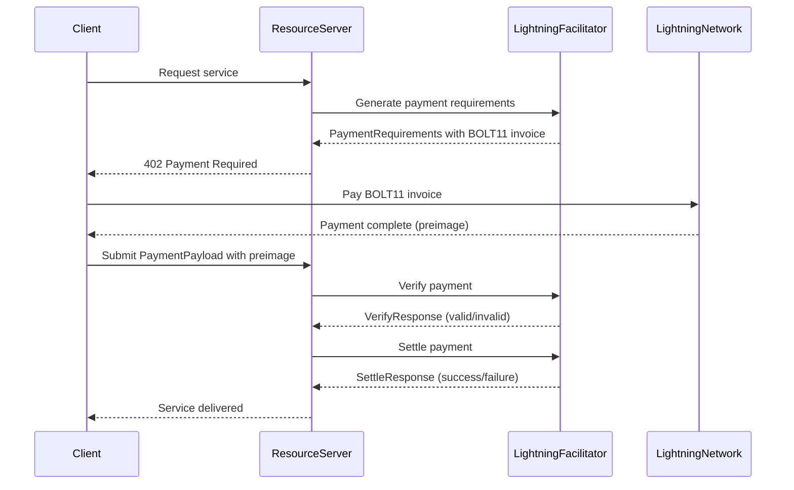

# Exact Payment Scheme for Lightning Network

This document specifies the `exact` payment scheme for the x402 protocol on Bitcoin's Lightning Network.

This scheme facilitates instant, low-fee Bitcoin payments using native Lightning Network capabilities with BOLT11 invoices and preimage verification.

## Scheme Name

`exact`

## Key Features

- **Proven Standard**: Uses broadly adopted BOLT11 spec to maximize compatibility
- **Instant Settlement**: Sub-second payment confirmation
- **Micropayment Friendly**: Sub-cent transactions with minimal fees
- **High Reliability**: Exceptional payment success rates with robust error handling
- **Security Hardened**: Protects against preimage reuse and routing attacks

## Protocol Flow Overview

The protocol flow for `exact` on Lightning Network follows the standard [x402 pattern](https://github.com/coinbase/x402?tab=readme-ov-file#v1-protocol-sequencing):

1. **Client** makes an HTTP request to a **Resource Server**
2. **Resource Server** calls Lightning Facilitator to generate payment requirements with BOLT11 invoice
3. **Resource Server** responds with a `402 Payment Required` status containing the `paymentRequirements`
4. **Client** pays the Lightning invoice and obtains the preimage
5. **Client** sends payment submission with `PaymentPayload` containing the preimage
6. **Resource Server** calls Lightning Facilitator to verify the preimage against invoice database
7. **Resource Server** calls Lightning Facilitator to settle the payment
8. **Resource Server** grants the **Client** access to the resource

## Sequence Diagram



## `PaymentRequirements` for `exact`

```json
{
  "scheme": "exact",
  "network": "lightning",
  "maxAmountRequired": "5000000",
  "asset": "BTC",
  "payTo": "03a1b2c3d4e5f6789...",
  "resource": "https://api.example.com/ai-service",
  "description": "Batch AI inference request",
  "mimeType": "application/json",
  "maxTimeoutSeconds": 60,
  "extra": {
    "invoice": "lnbc50u1..."
  }
}
```

### Field Descriptions

* `maxAmountRequired`: Payment amount in millisatoshis (msat)
* `asset`: The currency to be paid ("BTC")
* `payTo`: Lightning node public key
* `extra.invoice`: BOLT11 Lightning invoice generated by the facilitator


## `PaymentPayload` Structure

The client submits payment using the standard x402 `PaymentPayload` format:

```json
{
  "x402Version": 1,
  "scheme": "exact",
  "network": "lightning",
  "payload": {
    "preimage": "a1b2c3d4e5f6789..."
  }
}
```

The `payload` field contains the preimage obtained from the Lightning Network after successful payment.

## Lightning Facilitator Responsibilities

The Lightning Facilitator handles all Lightning-specific operations:

### Invoice Generation
- Generate BOLT11 invoices with correct amount and expiry
- Store invoice metadata (payment_hash, amount, expiry) for later verification
- Return `PaymentRequirements` with invoice in `extra.invoice` field

### Payment Verification
- Receive `PaymentPayload` with preimage from server
- Compute payment_hash = SHA256(preimage)
- Lookup stored invoice using payment_hash
- Validate invoice amount matches original requirements
- Check preimage hasn't been used before (prevent replay attacks)
- Return `VerifyResponse` with validation result

### Payment Settlement
- Record successful payment in facilitator's database
- Return `SettleResponse` with transaction details
- Clean up used preimages and expired invoices

## Security Considerations

**Lightning Facilitator Security**:
- MUST store invoice metadata securely with payment_hash indexing
- MUST validate preimage corresponds to a legitimate invoice
- MUST prevent preimage reuse through blacklisting or nonce tracking
- MUST validate invoice amounts match original payment requirements
- MUST handle invoice expiry properly

---

## References

- [BOLT 11: Invoice Protocol for Lightning Payments](https://github.com/lightning/bolts/blob/master/11-payment-encoding.md)
- [Lightning Network Security Guidelines](https://lightning.engineering/security/)
- [x402 Core Protocol Specification](https://github.com/coinbase/x402)
- [Lightning Network Developer Resources](https://lightning.engineering/)