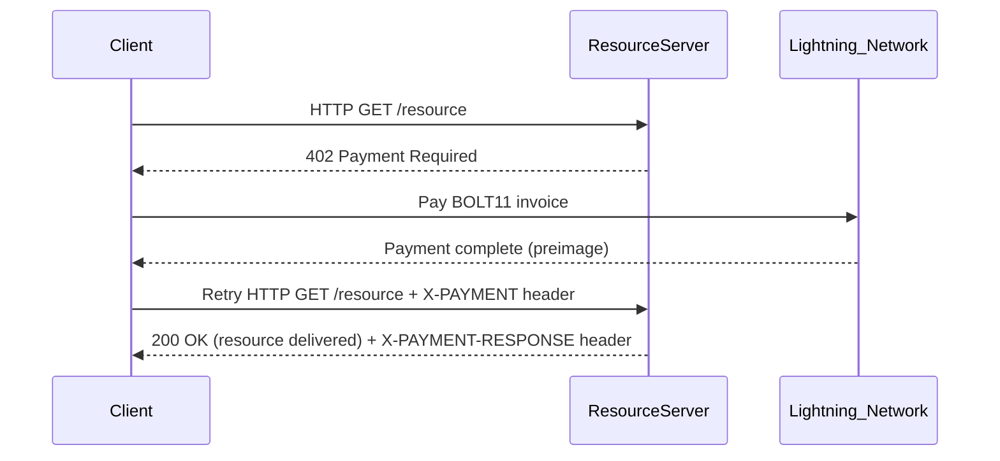

# Exact Payment Scheme for Lightning Network

This document specifies the `exact` payment scheme for the x402 protocol on Bitcoin's Lightning Network.

This scheme facilitates instant, low-fee Bitcoin payments using native Lightning Network capabilities with robust security and reliability optimizations.

## Scheme Name

`exact`

## Key Features

- **Instant Settlement**: Sub-second payment confirmation
- **Micropayment Friendly**: Sub-cent transactions with minimal fees
- **High Reliability**: Exceptional payment success rates with robust error handling
- **Security Hardened**: Protects against preimage reuse and routing attacks
- **Advanced Features**: Multi-part payments and dynamic channel optimization

## Protocol Flow

The protocol flow for `exact` on Lightning Network is client-driven:

1. **Client** makes an HTTP request to a **Resource Server**
2. **Resource Server** responds with a `402 Payment Required` status. The response body contains the `paymentRequirements` for the `exact` scheme
3. **Client** pays the Lightning invoice contained in the `extra.invoice` field using their Lightning node
4. **Client** sends a new HTTP request to the resource server with the `X-PAYMENT` header containing the payment proof
5. **Resource Server** receives the request and verifies the payment
6. **Resource Server** grants the **Client** access to the resource in its response

## `PaymentRequirements` for `exact`

```json
{
  "scheme": "exact",
  "network": "lightning",
  "maxAmountRequired": "5000000",
  "asset": "BTC",
  "payTo": "03a1b2c3d4e5f6789...",
  "resource": "https://api.example.com/ai-service",
  "description": "Batch AI inference request",
  "mimeType": "application/json",
  "maxTimeoutSeconds": 60,
  "extra": {
    "invoice": "lnbc50u1..."
  }
}
```

### Field Descriptions

* `maxAmountRequired`: Payment amount in millisatoshis (msat)
* `asset`: The currency to be paid (e.g., "BTC")
* `payTo`: Lightning node public key or Lightning address
* `extra.invoice`: BOLT11 Lightning invoice for the payment


## `X-PAYMENT` Header Payload

The `X-PAYMENT` header is base64 encoded and sent in the request from the client to the resource server when paying for a resource.

Once decoded, the `X-PAYMENT` header is a JSON string with the following properties:

```json
{
  "x402Version": 1,
  "scheme": "exact",
  "network": "lightning",
  "payload": {
    "preimage": "a1b2c3d4e5f6789..."
  }
}
```

The `payload` field contains the preimage, which serves as the proof of payment for the Lightning payment.

## `X-PAYMENT-RESPONSE` Header Payload

The `X-PAYMENT-RESPONSE` header is base64 encoded and returned to the client from the resource server.

Once decoded, the `X-PAYMENT-RESPONSE` is a JSON string with the following properties if succeeded:

```json
{
  "success": true,
  "network": "lightning"
}
```

Alternatively, a failure response may look like:

```json
{
  "success": false,
  "network": "lightning",
  "error": "EXPIRED_PAYMENT"
}
```

## Sequence Diagram



## Server Verification Process

The server verifies the Lightning payment by:

1. **Extract preimage** from the `X-PAYMENT` header payload
2. **Compute payment hash**: `SHA256(preimage)`
3. **Lookup invoice record** using the computed payment hash from server's invoice database
4. **Verify invoice authenticity**: Confirm the invoice was generated by this server
5. **Validate payment amount**: Ensure the original invoice amount matches payment requirements
6. **Check preimage uniqueness**: Ensure this preimage hasn't been used before
7. **Validate timing**: Confirm the invoice hasn't expired
8. **Grant access** to the protected resource

**Critical Security Requirements**:
- Server MUST store original invoice details (amount, expiry, payment_hash) when generating invoices
- Server MUST validate that payment_hash corresponds to an invoice with the correct amount
- Server MUST prevent payment hash manipulation attacks by checking invoice amount matches requirements
- Server MUST maintain a blacklist of used preimages to prevent reuse attacks


---

## References

- [BOLT 11: Invoice Protocol for Lightning Payments](https://github.com/lightning/bolts/blob/master/11-payment-encoding.md)
- [Lightning Network Security Guidelines](https://lightning.engineering/security/)
- [x402 Core Protocol Specification](https://github.com/coinbase/x402)
- [Lightning Network Developer Resources](https://lightning.engineering/)