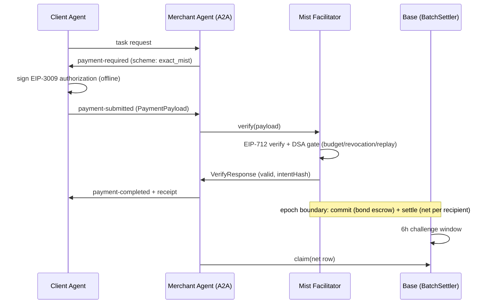

# Exact Payment Scheme for Mist Batch Settlement

This document specifies the `exact_mist` payment scheme for the x402 protocol, settling on Base via Mist's optimistic batch settlement.

This scheme lets an A2A client pay the way it already does with the `exact` scheme (a standard EIP-3009 signed authorization, zero client-side wallet changes) while the payment settles through batch settlement: many payments are aggregated into one on-chain settlement epoch, cutting per-payment gas by 1-2 orders of magnitude whenever recipients repeat - which is the normal case between agents and their service providers.

## Scheme Name

`exact_mist`

## Key Features

* **Client-identical to `exact`**: the client signs a standard EIP-3009
  `transferWithAuthorization` (USDC on Base). No new wallet work, no pre-funding, no
  channel state.
* **Batched on-chain cost**: one `commit` + one `settle` per epoch amortized across N
  payments — measured floor ≈ (246k + 78,958·R)/N gas per payment on Base (anvil-fitted;
  mainnet-validated at +10–11% systematic on the first real epoch), vs 61,105–90,053 gas
  for a direct per-payment settlement.
* **Authorized, not just signed**: every payment crosses Mist's DSA gate (delegated
  spending authorization: budget, revocation, replay) before batch acceptance — the
  facilitator enforces agent-side budgets, not just per-payment validity.
* **Honest finality**: acceptance is instant and ledgered; on-chain settlement is
  eventual (per epoch, with a 6-hour challenge window and an operator bond at stake).
  The exposure window is bounded and stated, not hand-waved — see Security.

## Protocol Flow Overview

1. Client agent calls the merchant agent's service (A2A task request).
2. Merchant agent determines payment is required and returns a `payment-required`
   message whose `paymentRequirements` use `scheme: "exact_mist"`.
3. Client builds the standard EIP-3009 authorization (USDC `transferWithAuthorization`,
   `maxAmountRequired`, EIP-712 typed data) and signs it — **identical to `exact`**.
4. Client returns `payment-submitted` carrying the `PaymentPayload`.
5. The Mist facilitator verifies the EIP-712 signature, checks the authorization against
   the DSA gate (delegation validity, budget remaining, revocation status, replay
   nonce), and — if all pass — **accepts** the payment into the current settlement
   epoch and ledgers it.
6. Facilitator returns `VerifyResponse` (valid) → merchant agent delivers the service
   and emits `payment-completed` with a receipt (`intentHash`).
7. Per epoch, the facilitator's operator commits the batch (commitment root + bond in
   escrow) and settles the **net per recipient** on Base.
8. After the 6-hour challenge window closes without a successful fraud challenge,
   recipients claim their net; the bond is released back to the operator.

## Sequence Diagram



## PaymentRequirements for `exact_mist`

| Field | Type | Description |
|---|---|---|
| `scheme` | string | `"exact_mist"` |
| `network` | string | CAIP-2 chain id of the settlement chain, e.g. `eip155:8453` (Base) |
| `asset` | string | USDC contract address on the settlement chain |
| `payTo` | string | The Mist operator's settlement address (recipient of the EIP-3009 authorization) |
| `maxAmountRequired` | string | Maximum amount in asset atomic units (v2: `amount`) |
| `resource` | string | The resource being paid for (A2A task/service identifier) |
| `description` | string | Human-readable description |
| `mimeType` | string | MIME type of the resource response |
| `maxTimeoutSeconds` | number | Window the client's authorization remains acceptable |
| `extra` | object | `extra.finality`: `"epoch"` (acceptance-ledgered, on-chain settlement per epoch); `extra.facilitator`: URL of the Mist gateway submitting this epoch |

## PaymentPayload Structure

```json
{
  "x402Version": 2,
  "scheme": "exact_mist",
  "network": "eip155:8453",
  "payload": {
    "authorization": {
      "from": "0x…",
      "to": "<payTo>",
      "value": "<maxAmountRequired>",
      "validAfter": "<uint48>",
      "validBefore": "<uint48>",
      "nonce": "<32-byte hex>"
    },
    "signature": { "r": "0x…", "s": "0x…", "yParity": 0 },
    "from": "0x…"
  }
}
```

The payload is **byte-compatible with the `exact` scheme's EIP-3009 payload**. Encoding:
standard base64 in the `PAYMENT-SIGNATURE` / payment header (v2) or base64url body
field (v1), matching the directory's other drafts.

## Mist Facilitator Responsibilities

**Verification (synchronous, before acceptance):**

* Recover and validate the EIP-712 signature on the EIP-3009 authorization.
* Enforce the DSA gate: the authorization must resolve to a delegation whose owner
  signature is valid, whose remaining budget covers `value`, whose revocation status is
  clean at check time, and whose replay nonce is fresh. Any gate failure → invalid.
* Check `validAfter`/`validBefore` against the current time and `value` against
  `maxAmountRequired`.
* On success, ledger the payment and return an `intentHash` receipt. Acceptance is
  idempotent per nonce; replays are rejected.

**Settlement (asynchronous, per epoch):**

* Commit the epoch: 32-byte commitment/revocation/acceptance roots + operator bond in
  escrow (operator-chosen amount, no protocol minimum). **The bond enters at `commit`,
  which precedes `settle`** — so every *accepted* payment is bonded from its epoch's
  commit onward. The residual exposure is the acceptance→commit interval for the still-
  open epoch; facilitators SHOULD bound it by epoch cadence (commit at fixed wall-clock
  or batch-size intervals) and SHOULD state the cadence in `extra.facilitator`
  documentation. A facilitator that accepts payments but never commits accumulates
  unverifiable ledger debt and no bond — reputation and cadence disclosure are the
  mitigations the scheme offers there; it does not pretend otherwise.
* Settle the net per distinct recipient with settlement funding (`msg.value ≥ Σnet`).
* Post-window: recipients claim net rows; the operator releases the bond.
* A permissionless fraud path (0.1 ETH challenger deposit) covers the window: a proven
  mismatch between the committed root and the settled net voids the epoch and forfeits
  the bond to the challenger. **Status note (honest seam):** the settlement contracts'
  on-chain commitment-verification currently uses a placeholder verifier; the full ZK
  proof verification is a separate, in-progress workstream. The fraud path is
  protocol-complete; verification depth is its known open seam and is documented as
  such in the reference implementation.

## Security Considerations

**The facilitator MUST:**

* Fail closed on every DSA-gate read error (unknown delegation, backend unavailable) —
  never accept on missing evidence.
* Track replay nonces durably and reject re-submission of an accepted authorization.
* Verify revocation status at ingest time, not only at settlement time.
* Keep client authorizations segregated per network and asset; never re-submit an
  authorization to a chain or contract other than the one named in `network`/`payTo`.

**The resource server (merchant agent) MUST:**

* Treat `VerifyResponse (valid)` as acceptance-ledgered, not as on-chain finality; the
  on-chain net settles per epoch and is claimable after the challenge window.
* For high-value deliveries, verify the receipt via the facilitator's read endpoint
  (`GET /v1/receipts/{intentHash}`: hit = accepted and not yet settled; on-chain
  finality is observable on the settlement contract by `epochId`).
* Never hold client keys or signing material; the client signs once, offline.

## Status

Experimental draft for the `schemes/` directory (not part of the x402 specification).
Reference implementation: Mist's x402 adapter — v1/v2 dual-protocol wire layer with an
EIP-3009 exact bridge (standard x402 clients interop unmodified; verified end-to-end
against the official `@x402/axios` + `@x402/evm` v2 client), deployed on Base mainnet
(chain 8453). Internally the reference implementation registers this scheme as
`mist-v1`/`mist` per its own convention; the mapping is an implementation detail.

## References

* a2a-x402 specification: `spec/v0.1/spec.md` (this repository)
* x402 protocol: https://github.com/coinbase/x402
* EIP-3009 (TransferWithAuthorization): https://eips.ethereum.org/EIPS/eip-3009
* Mist settlement contracts & measured gas ledger: https://github.com/changshenhan/mist
* USDC on Base: `0x833589fCD6eDb6E08f4c7C32D4f71b54bdA02913`
