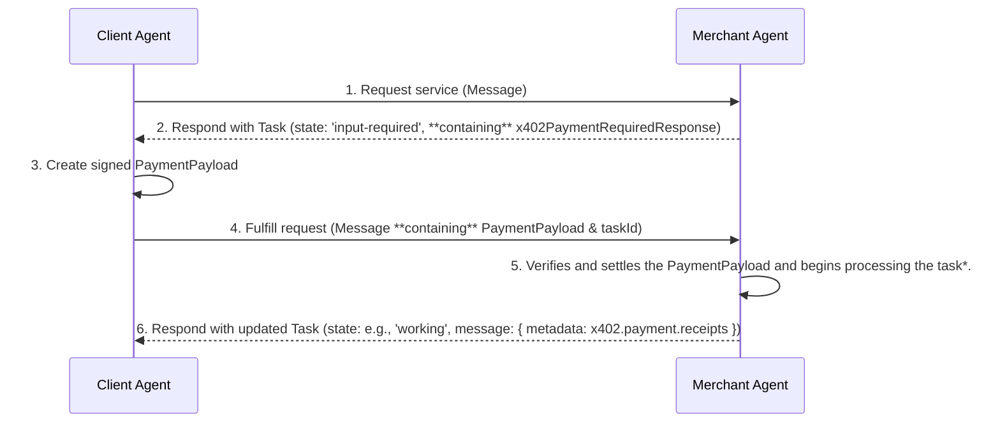
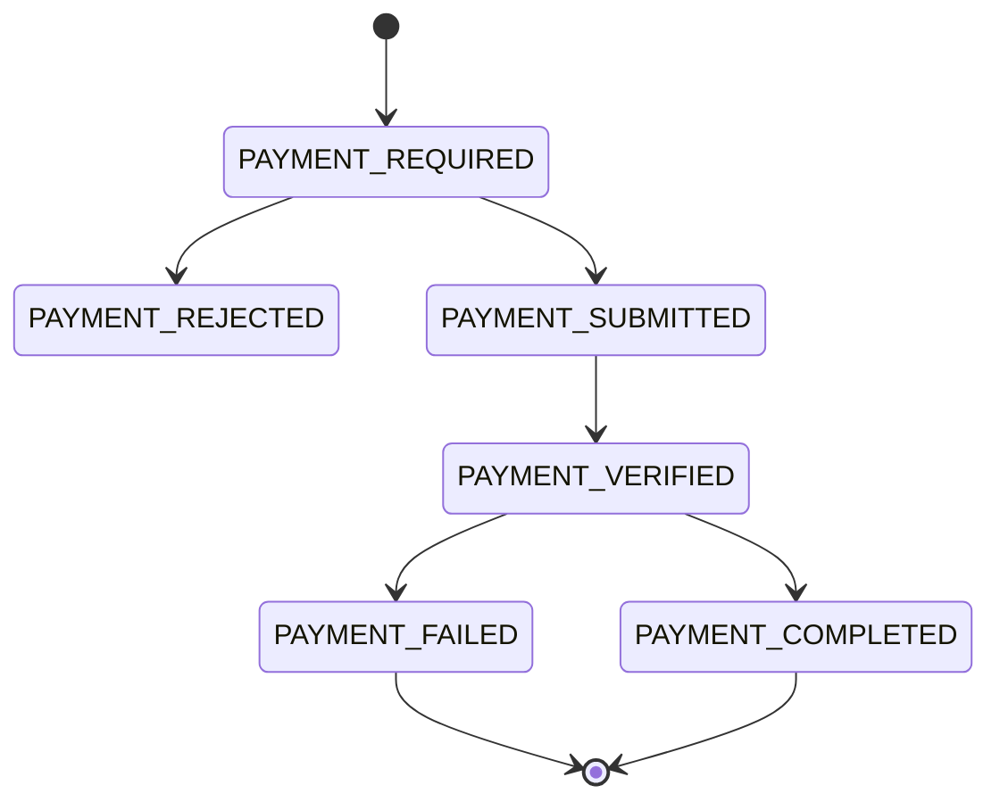

# A2A Protocol: x402 Payments Extension v0.2

## **1\. Abstract**

The x402 Payments Extension is an **Extension** for the Agent-to-Agent (A2A) protocol. It enables agents to monetize services through on-chain cryptocurrency payments, reviving the spirit of the HTTP 402 "Payment Required" status code for the world of decentralized agents.

This specification defines the required data structures and state machine for on-chain payments. It is designed to be **composable**, supporting two modes of operation: a **Standalone Flow** for simple, standalone monetization, and an **Embedded Flow** where its data structures are nested within higher-level protocols (such as the [AP2 commerce protocol](https://github.com/google-agentic-commerce/AP2)) for atomic transactions.

## **2\. Extension URI**

The canonical URI for this version of the extension is: `https://github.com/google-agentic-commerce/a2a-x402/blob/main/spec/v0.2`

Implementations of this extension MUST use this URI for declaration and activation.

## **3\. Extension Declaration**

Agents that support this extension MUST declare it in the `extensions` array of their `AgentCard`.

```
{
  "capabilities": {
    "extensions": [
      {
        "uri": "https://github.com/google-agentic-commerce/a2a-x402/blob/main/spec/v0.2",
        "description": "Supports payments using the x402 protocol for on-chain settlement.",
        "required": true
      }
    ]
  }
}
```

### **3.1. Required Extension**

Setting `required: true` is recommended. This signals to clients that they **MUST** understand and implement the x402 protocol to interact with the agent's monetized skills. If a required extension is not activated by the client, the agent should reject the request.

## **4\. Composable Design: Standalone vs. Embedded Flows**

This extension is designed for composability and supports two distinct flows. Agents supporting this extension SHOULD be prepared to handle either flow.

* **Standalone Flow:** This is the simplest flow, used for direct monetization without a higher-level payments protocol.   
  * The `x402PaymentRequiredResponse` object is transported in the `task.status.message.metadata`.  
  * The `PaymentPayload` object is transported in the `message.metadata`.  
* **Embedded Flow (Composable):** This flow is used when x402 is acting as a Form of Payment (FOP) for a higher-level protocol, such as [AP2](https://ap2-protocol.org). This allows for the agent to implement other payment protocols and facilitate payments via x402.  This would be represented by the Agent Card presenting both the x402 extension AND the other payment framework extension, e.g. the [Agent Payment Protocol.](http://ap2-protocol.org)  
  * The `x402PaymentRequiredResponse` object is **embedded** inside a higher-level object (e.g., an AP2 `CartMandate`) located in the `task.artifacts` array.  
  * The `PaymentPayload` object is **embedded** inside a higher-level object (e.g., an AP2 `PaymentMandate`) located in the `message.parts` array.

### **4.1. Embedded Flow and Signing Models**

A key consideration in the **Embedded Flow** is the interaction between the x402 payment payload and the higher-level commerce protocol it is embedded within. This section clarifies how to handle payload signing without introducing user friction.

**The Core Interaction** Many commerce protocols are designed for "pull" payment methods (e.g., credit cards), where a user-signed mandate authorizes a merchant to *pull* funds using a token. The x402 protocol, however, functions as a "push" payment method, where the `x402PaymentPayload` *is* the signed cryptographic authorization to *push* on-chain funds.

In the embedded flow, an **order authorization** (which authorizes the *specific purchase, e.g. PaymentMandate in  AP2*) envelops the `x402PaymentPayload` (which authorizes the *payment*). While this may require two distinct signatures (one for the payment, one for the order), it doesn’t need to result in two separate approval prompts for the user.

This specification supports three primary patterns to manage this, ensuring a seamless user experience.

#### **1\. Atomic Signing (Human-Present Flow)**

This is the recommended pattern for direct, human-present transactions from a user's primary wallet. The Client Agent and wallet abstract the complexity of the two signatures into a single user action.

1. **Construction:** The Client Agent assembles the *unsigned* order authorization and the *unsigned* `x402PaymentPayload`.  
2. **Single User Approval:** The Client Agent passes both objects to a compatible wallet or signing service. The wallet's UI presents a **single, unified confirmation** to the user (e.g., "Approve payment of 120.00 USDC for 'Nike Air Max'").  
3. **Atomic Signature:** Upon a single user approval, the wallet or signing service performs two signatures in the background:  
   * First, it signs the `x402PaymentPayload`.  
   * Second, it embeds the newly signed `x402PaymentPayload` into the data field of the order authorization.  
   * Finally, it signs the complete order authorization.

The Merchant Agent then receives the order authorization containing the `x402PaymentPayload`, both of which are verifiably signed with a single user action.

#### **2\. Delegated Signing (Human-Not-Present Flow)**

This pattern is ideal for asynchronous agentic commerce and aligns with concepts like delegated authority.

1. **Pre-Authorization:** At an earlier time, the user signs a pre-authorization object. This signature grants the **Client Agent** delegated authority to execute transactions on the user's behalf within specific constraints (e.g., "buy these shoes if the price drops below $100").  
2. **Agent-Handled Execution:** When the purchase conditions are met, the Client Agent acts as a pre-authorized delegate. It uses its *own* key (or a delegated key) to generate and sign both the `x402PaymentPayload` and the accompanying order authorization.

In this flow, the user is not present at the time of payment, and the signing is handled entirely by the trusted, pre-authorized agent, resulting in zero user friction at checkout.

#### **3\. Smart Contract Escrow (Decoupled Flow)**

This pattern models a "pull" payment flow and is ideal for users who pre-fund a dedicated contract. It completely separates the on-chain payment action from the at-checkout signing action.

1. **Setup (One-time Action):** The user moves funds into a smart contract (e.g., a "paymaster" contract, an escrow, or a smart contract wallet). This on-chain transaction is the *only* on-chain "push" the user performs.  
2. **Checkout (Single Off-Chain Signature):** At the time of purchase, the Client Agent constructs *only* the **order authorization**. The user signs this single, off-chain message. There is no `x402PaymentPayload` signature from the user's primary wallet.  
3. **Settlement (Merchant Initiated):** The Merchant Agent receives the user-signed order authorization.  
4. **Verification & Release:** The Merchant Agent presents this signed order to the smart contract. The contract is programmed to:  
   * Verify the user's signature on the order authorization.  
   * Confirm the order details match its rules.  
   * If valid, *release* the pre-deposited funds directly to the merchant.

In this flow, the smart contract itself acts as the trusted "Payer." The `x402PaymentPayload` embedded in the order would simply contain the contract's address and the data (like the signed order) that the merchant needs to call its "release funds" function. This mirrors a credential-based flow, as the user's signed order acts as the "credential" to unlock the payment.

### 4.2. Flow Detection Logic

A Client Agent must be able to distinguish between the Standalone and Embedded flows. The detection logic is triggered upon receiving a `Task` where the `task.status.message.metadata` contains `x402.payment.status: "payment-required"`.

The agent MUST follow this decision path:

1.  Inspect the `task.status.message.metadata`.
2.  **Check for Standalone Flow:** Does the `metadata` **also** contain the `x402.payment.required` key?
    * **Yes:** This is a **Standalone Flow**. The agent MUST retrieve the `x402PaymentRequiredResponse` from the `metadata`'s `x402.payment.required` key.
    * **No:** This is an **Embedded Flow**.
3.  **Process Embedded Flow:** The agent MUST scan the `task.artifacts` array to find a supported higher-level artifact (e.g., an `AP2 CartMandate`) and extract the `x402PaymentRequiredResponse` from within it.

## **5\. Payment Protocol Flow**

This x402 extension represents the payment lifecycle using the high-level A2A Task state (e.g., `input-required`, `completed`) and a granular `x402.payment.status` field. The flow involves a Client Agent (acting on behalf of a user/client) that orchestrates interactions between a Merchant Agent (selling a service).

### **5.1. Roles & Responsibilities**

The x402 payment protocol defines the interactions between four distinct architectural roles. While a single application might combine some of these functions (e.g., a Client Agent with an integrated Signing Service), understanding their logical separation is key to a secure and correct implementation.

---

#### **Client Agent**

The Client Agent acts on behalf of a user, orchestrating the payment flow.

* Initiates service requests to the Merchant Agent.  
* Receives a `Task` that requires payment and processes the `x402PaymentRequiredResponse` from its specified location (either `metadata` or an `embedded` object).  
  * The agent first extracts the list of accepted PaymentRequirements from the response.  
  * It then determines whether to proceed with payment based on the terms (e.g., cost, asset, network).  
    * If accepting, the agent selects a preferred PaymentRequirements option and has it signed by a designated signing service or wallet. This service securely signs the object to create the PaymentPayload.  
    * If rejecting, the agent responds to the Merchant Agent with a x402.payment.status of payment-rejected.  
* Submits the signed `PaymentPayload` back to the Merchant Agent in its specified location (e.g in the Task metadata or embedded AP2 PaymentMandate).  
* Waits for and processes the final `Task`.

---

#### **Merchant Agent**

The Merchant Agent is a specialist agent that provides a monetized skill or service.

* Determines when a service request requires payment and responds with an `input-required` `Task` containing the `x402PaymentRequiredResponse` (either in `metadata` or `embedded`).  
* Receives the correlated payment submission.  
* Communicates with a type of facilitator to first verify the payment's signature and validity, and then to settle the transaction on-chain.  
* Concludes the flow by returning a final `Task` with the `x402.payment.receipts`.

**Note:** The Merchant Agent is responsible for state management, using the taskId to track the payment lifecycle. When it receives a payment submission, it uses the taskId to retrieve the original PaymentRequirements offered for that task. This allows the agent to validate that the signed PaymentPayload corresponds to a valid payment option it previously sent.

### **5.2. Architecture**

This diagram illustrates the generic A2A message exchange. The location of the x402 objects depends on the flow (Standalone vs. Embedded).

Code snippet



### **5.3. Step 1: Payment Request (Merchant → Client)**

The Merchant Agent creates a `Task`, sets its status to `input-required`, and includes the `x402PaymentRequiredResponse` object. In both flows, the `status.message.metadata` MUST contain `x402.payment.status: "payment-required"`.

---

*The following example shows the **Standalone Flow** implementation.*

```
/* --- Standalone Flow Example --- */
/* This is the response from MA to CA */
{
  "jsonrpc": "2.0",
  "id": "req-001",
  "result": {
    "kind": "task",
    "id": "task-123",
    "status": {
      "state": "input-required",
      "message": {
        "kind": "message",
        "role": "agent",
        "parts": [{ "kind": "text", "text": "Payment is required." }],
        "metadata": {
          "x402.payment.status": "payment-required",
          "x402.payment.required": {
            "x402Version": 1,
            "accepts": [{ /* ... PaymentRequirements object ... */ }]
          }
        }
      }
    }
  }
}
```

---

*The following example shows the **Embedded Flow** implementation (AP2 \+ x402).*

```
/* --- Embedded Flow Example (AP2 + x402) --- */
/* This is the response from MA to CA */
{
  "jsonrpc": "2.0",
  "id": "req-001",
  "result": {
    "kind": "task",
    "id": "task-abc-123",
    "status": {
      "state": "input-required",
      "message": {
        "kind": "message",
        "role": "agent",
        "parts": [{ "kind": "text", "text": "Payment is required for this cart." }],
        "metadata": {
          "x402.payment.status": "payment-required" 
        }
      }
    },
    "artifacts": [
      {
        "artifactId": "cart-mandate-456",
        "name": "AP2 CartMandate",
        "parts": [
          {
            "kind": "data",
            "data": {
            /* === AP2 CartMandate === */
            "ap2.mandates.CartMandate": {
              "id": "cart_shoes_123",
              "payment_request": {
                "method_data": [
                  {
                    "supported_methods": "https://www.x402.org/",
                    "data": {
                      "x402Version": 1,
                      "accepts": [{
                        "scheme": "exact",
                        "network": "base",
                        "asset": "0x833589fCD6eDb6E08f4c7C32D4f71b54bda02913",
                        "payTo": "0xMerchantWalletAddress",
                        "maxAmountRequired": "120000000"
                      }]
                    }
                  }
                ],
                "details": { "id": "order_shoes_123", "total": { "amount": { "currency": "USD", "value": 120.0 } } }
              }
            },
            "merchant_signature": "sig_merchant_abc1",
            "timestamp": "..."
          }
        }
      ]
  }
}
```

---

### **5.4. Step 2: Payment Authorization (Client → Wallet → Client)**

The Client Agent receives the `Task` and extracts the `x402PaymentRequiredResponse` object from its specified location (either `metadata` or an `embedded` artifact). It then has the object signed by a wallet to create the `PaymentPayload`.

1. **Client selects the preferred Payment Requirements:** The Client Agent extracts the x402PaymentRequiredResponse object from the task's message metadata, finds the preferred payment requirement object to sign and creates a PaymentPayload by signing the payment requirements via its wallet or preferred signing service.  
2. **Client Rejects PaymentRequirements:** The client rejects all PaymentRequirements options and responds to the server agent with a message setting the message metadata field x402.payment.status to payment-rejected.

### **5.5. Step 3: Fulfill and Settle (Client → Merchant → Client)**

The Client Agent sends a new `Message` linked to the `Task` via its `taskId`. This message contains the signed `PaymentPayload`. In both flows, the `message.metadata` MUST contain `x402.payment.status: "payment-submitted"`.

---

*The following example shows the **Standalone Flow** implementation.*

```
/* --- Standalone Flow Example --- */
/* This is the request from CA to MA */
{
  "jsonrpc": "2.0",
  "method": "message/send",
  "id": "req-003",
  "params": {
    "message": {
      "taskId": "task-123", /* <-- Links to the original request */
      "role": "user",
      "parts": [{ "kind": "text", "text": "Here is the payment authorization." }],
      "metadata": {
        "x402.payment.status": "payment-submitted",
        "x402.payment.payload": {
          "x402Version": 1,
          "network": "base",
          /* ... The signed PaymentPayload object ... */
        }
      }
    }
  }
}
```

---

*The following example shows the **Embedded Flow** implementation (AP2 \+ x402).*

```
/* --- Embedded Flow Example (AP2 + x402) --- */
/* This is the request from CA to MA */
{
  "jsonrpc": "2.0",
  "method": "message/send",
  "id": "req-002",
  "params": {
    "message": {
      "taskId": "task-abc-123", /* Links to the task */
      "role": "user",
      "parts": [
        {
          "kind":"data",
          "data": {
		 "ap2.mandates.PaymentMandate": {
              "payment_details": {
                "cart_mandate": "<user-signed hash of cart_shoes_123>",
		     "payment_request_id": "order_shoes_123",
                "payment_method": {
                  "supported_methods": "https://www.x402.org/",
                  "data": { // x402 Payment Payload
                    "x402Version": 1,
                    "network": "base",
                    "scheme": "exact",
                    "payload": {
                      /* ... The fully signed x402 transaction object ... */
                    }
                  }
                },
                "amount": { "currency": "USD", "value": 120.0 }
              },
              "creation_time": "..."
            }
	    }
        }
      ],
      "metadata": {
        /* Note: x402.payment.payload is NOT here */
        "x402.payment.status": "payment-submitted"
      }
    }
  }
}
```

---

**Merchant verifies, settles, and completes:** The Merchant receives the payload from its specified location, verifies it, and settles the payment. It then updates the original `Task`'s `status` to `completed` and includes the `x402PaymentReceipt` in the task's message `metadata`.

```
/* Payment Completed response from Merchant Agent to Client Agent (Applies to both flows) */
{
  "jsonrpc": "2.0",
  "id": "req-003",
  "result": {
    "kind": "task",
    "id": "task-123",
    "status": {
      "state": "completed",
      "message": { 
        "kind": "message",
        "role": "agent",
        "parts": [{ "kind": "text", "text": "Payment successful." }],
        "metadata": {
          "x402.payment.status": "payment-completed",
          "x402.payment.receipts": [{
            "success": true,
            "transaction": "0xabc123...",
            "network": "base"
          }]
        }
      }
    },
    "artifacts": [ /* ... service result ... */ ]
  }
}
```

## **6\. Data Structures**

This extension uses data structures defined in the core x402 Protocol Specification. For the complete and authoritative definition of all fields, please refer to the official [x402 Data Types documentation](https://github.com/coinbase/x402?tab=readme-ov-file#data-types).

The primary data structures from the x402 specification used by this extension are:

* **`x402PaymentRequiredResponse`**: Sent by the Merchant Agent to request a payment.  
* **`PaymentRequirements`**: Describes a single accepted payment option.  
* **`PaymentPayload`**: Contains the client's signed payment authorization.  
* **`x402SettleResponse`**: Returned by the Merchant Agent after payment settlement. This is used for the `x402.payment.receipts` field in the A2A protocol.

This approach ensures that the A2A extension remains a lightweight layer, focusing only on the protocol interactions, while the core x402 specification remains the single source of truth for the data models.

## **7\. Metadata and State Management**

This extension uses the `metadata` field on `Message` objects to track the payment state. The location of the data objects depends on the flow (Standalone vs. Embedded).

* `x402.payment.status`: **(Required)** The current stage of the payment flow. This key MUST be present in all x402-related messages. Values:  
  * `"payment-required"`: Payment requirements have been sent.  
  * `"payment-submitted"`: Payment payload has been received.  
  * `"payment-rejected"`: Payment requirements have been rejected.  
  * `"payment-verified"`: Payment payload has been verified.  
  * `"payment-completed"`: Payment transaction has been settled.  
  * `"payment-failed"`: Payment failed.  
* `x402.payment.required`: The **default metadata key** for the `x402PaymentRequiredResponse` object. This key is used *only* in the Standalone Flow. It MUST NOT be used if an Embedded Flow is active.  
* `x402.payment.payload`: The **default metadata key** for the `PaymentPayload` object. This key is used *only* in the Standalone Flow. It MUST NOT be used if an Embedded Flow is active.  
* `x402.payment.receipts`: **(Required)** A persistent array containing the complete history of all `x402SettleResponse` objects for the task. This key MUST be present in the final task message.  
* `x402.payment.error`: In case of failure, a short error code.

### **7.1. State Transitions**



## **8\. Extension Activation**

Clients MUST request activation of this extension by including its URI in the `X-A2A-Extensions` HTTP header. `X-A2A-Extensions: https://github.com/google-agentic-commerce/a2a-x402/blob/main/spec/v0.2`

## **9\. Error Handling**

If a payment fails, the server MUST set the x402.payment.status to payment-failed and provide a reason in the TaskStatus message and metadata. The management of Task states at payment failure is at the discretion of the Merchant Agent's implementation. For example the agent could leave the Task state as working or request a payment requirement with input-required again.

### **9.1. Common Error Codes**

| Code | Description |
| ----- | ----- |
| INSUFFICIENT\_FUNDS | The client's wallet has insufficient funds to cover the payment. |
| INVALID\_SIGNATURE | The payment authorization signature could not be verified. |
| EXPIRED\_PAYMENT | The payment authorization was submitted after its expiry time. |
| DUPLICATE\_NONCE | The nonce for this payment has already been used. |
| NETWORK\_MISMATCH | The payment was signed for a different blockchain network. |
| INVALID\_AMOUNT | The payment amount does not match the required amount. |
| SETTLEMENT\_FAILED | The transaction failed on-chain for a reason other than the above. |

### **9.2. Example Error Response**

```

{
  "kind": "task",
  "id": "task-123",
  "status": {
    "state": "failed",
    "message": {
      "kind": "message",
      "role": "agent",
      "parts": [{ "kind": "text", "text": "Payment verification failed: The signature has expired." }],
      "metadata": {
        "x402.payment.status": "payment-failed",
        "x402.payment.error": "EXPIRED_PAYMENT",
        "x402.payment.receipts": [{
            "success": false,
            "errorReason": "Payment authorization was submitted after its 'validBefore' timestamp.",
            "network": "base",
        "transaction": ""
        }]
      }
    }
  }
}
```

## **10\. Security Considerations**

* **Private Key Security**: Private keys MUST only be handled by trusted entities.  
* **Signature Verification**: Server agents MUST cryptographically verify every payment signature.  
* **Input Validation**: Servers MUST rigorously validate the contents of all payment-related data.  
* **Replay Protection**: Servers MUST track used nonces to prevent replay attacks.  
* **Transport Security**: All A2A communication MUST use a secure transport layer like HTTPS/TLS.

## **11\. References**

* [**A2A Protocol Specification**](https://a2a-protocol.org/latest/specification)  
* [**A2A Extensions Documentation**](https://github.com/a2aproject/A2A/blob/main/docs/topics/extensions.md)  
* [**x402 Protocol Specification**](https://x402.gitbook.io/x402)