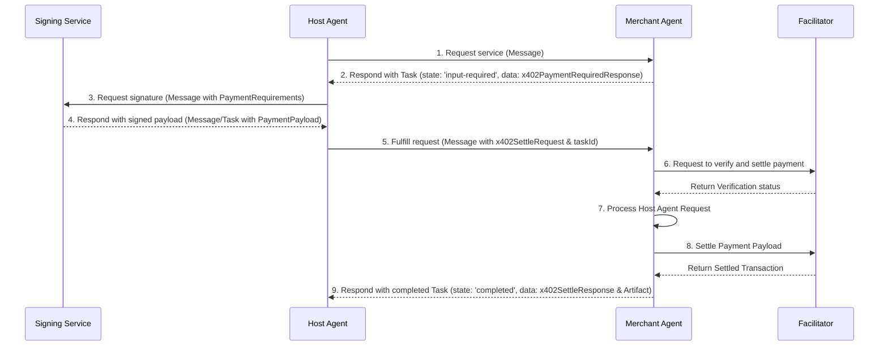

# **A2A Protocol: x402 Payments Extension v0.1**

## **1\. Abstract**

The x402 Payments Extension is a **Profile Extension** for the Agent-to-Agent (A2A) protocol. It enables agents to monetize services through on-chain cryptocurrency payments, reviving the spirit of the HTTP 402 "Payment Required" status code for the world of decentralized agents.

This specification defines the required data structures, message flows, and state machine for requesting, authorizing, and settling payments within the A2A framework. It allows a server agent to require payment for a service, a client agent to authorize that payment using a secure wallet, and the server to verify and settle the transaction on a blockchain network.

## **2\. Extension URI**

The canonical URI for this version of the extension is:

```
https://google-a2a.github.io/A2A/extensions/payments/x402/v0.1
```

Implementations of this extension MUST use this URI for declaration and activation.

## **3\. Extension Declaration**

Agents that support this extension MUST declare it in the `extensions` array of their `AgentCard`.

```
{
  "capabilities": {
    "extensions": [
      {
        "uri": "https://google-a2a.github.io/A2A/extensions/payments/x402/v0.1",
        "description": "Supports payments using the x402 protocol for on-chain settlement.",
        "required": true,
      }
    ]
  }
}

```

### **3.1. Required Extension**

Setting `required: true` is recommended. This signals to clients that they **MUST** understand and implement the x402 protocol to interact with the agent's monetized skills. If a required extension is not activated by the client, the agent should reject the request.

## **4\. Payment Protocol Flow**

The x402 extension maps the payment lifecycle to the A2A Task state machine. The flow involves a **Host Agent** (acting on behalf of a user/client) that orchestrates interactions between a **Merchant Agent** (selling a service) and a **Signing Service** (handling cryptographic signatures).

* **Host/Client Agents** primarily relay information by sending `Message` objects.
* **Signing Service** Entity that has the capability of signing a PaymentRequirement and creating a PaymentPayload.  This could be another agent, and MCP server, or the Host agent could call the x402 Client directly itself.
* **Merchant Agents** are specialist agents that respond with stateful `Task` objects or simple `Message` objects containing the data requested by the Host.  
* All x402-specific data objects (`PaymentRequirements, x402PaymentRequiredResponse`, `PaymentPayload, x402SettleRequest, x402SettleResponse`) are passed within the `metadata` field of `Task` or `Message` objects.
* **Facilitator** Entity that is able to verify and settle payment payload according the x402 protocol definition.

### **4.1. Architecture**



### **4.2. Step 1: Payment Request (Merchant → Host)**

When a Host Agent requests a service, the Merchant Agent determines that payment is required. It creates a `Task`, sets its status to `input-required`, and includes the `x402PaymentRequiredResponse` object in the `metadata` of the `Task`. This `Task` is sent back to the Host Agent.

**Task State:** `input-required` 

**Task Metadata:** `x402.payment.status: "payment-required"`, `x402.payment.requirements: { ... }`

```
/* Response from Merchant Agent to Host Agent */
{
  "jsonrpc": "2.0",
  "id": "req-001",
  "result": {
    "kind": "task",
    "id": "task-123",
    "status": {
      "state": "input-required",
      "message": {
        "kind": "message",
        "role": "agent",
        "parts": [
          { "kind": "text", "text": "Payment is required to generate the image." }
        ]
      }
    },
    "metadata": {
      "x402.payment.status": "payment-required",
      "x402.payment.required": {
        "x402Version": 1,
        "accepts": [{
          "scheme": "exact",
          "network": "base",
          "resource": "https://api.example.com/generate-image",
          "description": "Generate an image",
          "mimeType": "application/json",
          "outputSchema": {},
          "asset": "0x833589fCD6eDb6E08f4c7C32D4f71b54bda02913",
          "payTo": "0xServerWalletAddressHere",
          "maxAmountRequired": "48240000",
          "maxTimeoutSeconds": 600,
          "extra": {
			"name": "USD Coin",
			"version": 2
          }
        }]
      }
    }
  }
}

```

### **4.3. Step 2: Payment Authorization (Host → Signing Service → Host)**

The Host Agent receives the `Task` and must now get the payment authorized.

1. **Host selects relays the payment requirements to the signing service:** The Host Agent extracts the `x402PaymentRequiredResponse` object from the task's metadata, finds the preferred payment requirement object to sign and calls its preferred signing service, asking it to sign the transaction.

2. **Signing Service returns signed payload:** The Signing Service validates the request, signs it securely, and returns the `x402PaymentPayload` object to the Host Agent.

### **4.4. Step 3: Fulfill and Settle (Host → Merchant → Host)**

**Host relays signed payload to Merchant:** The Host Agent receives the signed payload and sends it back to the Merchant Agent in the `metadata` of a new `Message`. This message **MUST** include the `taskId` from the original payment request so the Merchant can correlate the payment to the correct service.

```
/* Request from Host Agent to Merchant Agent */
{
  "jsonrpc": "2.0",
  "method": "message/send",
  "id": "req-003",
  "params": {
    "message": {
      "taskId": "task-123", /* <-- CRITICAL: Links to the original request */
      "role": "user",
      "parts": [
        { "kind": "text", "text": "Here is the payment authorization." }
      ],
      "metadata": {
        "x402.payment.status": "payment-submitted",
	  "x402.payment.requirements": {  /* ... The selected payment requirements */ }
        "x402.payment.payload": { /* ... The signed object from the Host's signing service ... */ }
      }
    }
  }
}
```

**Merchant verifies, settles, and completes:** The Merchant receives the signed payload, verifies it, and settles the payment on-chain. It updates the original `Task`'s state to `completed`, provides the service result as an `Artifact`, and includes the `x402PaymentReceipt` in the task's `metadata`.  
**Task State:** `working` → `completed` 

**Task Metadata:** `x402.payment.status: "payment-pending"` → `"payment-completed"`

```
/* Final response from Merchant Agent to Host Agent */
{
  "jsonrpc": "2.0",
  "id": "req-003",
  "result": {
    "kind": "task",
    "id": "task-123",
    "status": {
      "state": "completed",
      "message": { /* ... */ }
    },
    "artifacts": [ /* ... service result ... */ ],
    "metadata": {
      "x402.payment.status": "payment-completed",
      "x402.payment.receipt": {
        "success": true,
        "transaction": "0xabc123...",
        "network": "base",
        "payer": "0xpayerAddress"
      }
    }
  }
}
```

## **5\. Data Structures**

### **5.1. `x402PaymentRequiredResponse`**

Sent by the Merchant Agent in the `metadata` of a `Task` to request payment.

| Field | Type | Required | Description |
| ----- | ----- | ----- | ----- |
| `x402Version` | number | Yes | The version of the x402 protocol being used (e.g., 1). |
| `accepts` | `PaymentRequirements[]` | Yes | An array of accepted payment options. The client can choose any one. |

### **5.2. `PaymentRequirements`**

Describes a single way a client can pay.

| Field | Type | Required | Description |
| ----- | ----- | ----- | ----- |
| `scheme` | string | Yes | The payment scheme (e.g., "exact"). |
| `network` | string | Yes | The blockchain network identifier (e.g., "base"). |
| `asset` | string | Yes | The contract address of the token to be paid. |
| `payTo` | string | Yes | The recipient's wallet address. |
| `maxAmountRequired` | string | Yes | The required payment amount in the token's smallest unit (e.g., wei). |
| `resource` | string | No | A unique identifier for the resource being purchased. |
| `description` | string | No | A human-readable description of the payment. |
| `maxTimeoutSeconds` | number | No | The number of seconds the payment requirements are valid for. |
| `extra` | object | No | A container for additional scheme-specific data (e.g., EIP-712 domain info). |

### **5.3. `PaymentPayload`**

Created by the Signing Service, containing the signed payment authorization.

| Field | Type | Required | Description |
| ----- | ----- | ----- | ----- |
| `x402Version` | number | Yes | The version of the x402 protocol being used. |
| `network` | string | Yes | The blockchain network for the payment. |
| `scheme` | string | Yes | The payment scheme being used. |
| `payload` | object | Yes | The signed payment details, specific to the scheme. |

### **5.4. `x402SettleRequest`**

Sent by the Client Agent in `Message` metadata to the Merchant Agent, containing the signed payment authorization.

| Field | Type | Required | Description |
| ----- | ----- | ----- | ----- |
| `paymentRequirements` | `PaymentRequirements` | Yes | The selected payment requirements. |
| `paymentPayload` | `PaymentPayload` | Yes | The signed payment payload |

### **5.5. `x402SettleResponse`**

Returned by the Merchant Agent in `Task` metadata after a successful payment.

| Field | Type | Required | Description |
| ----- | ----- | ----- | ----- |
| `success` | bool | Yes | Status of the transaction settlement |
| `errorReason` | string | No | Error reason for unsuccessful settlement |
| `transaction` | string | No | The on-chain transaction hash of the settled payment. Present only if `success` is true. |
| `network` | string | Yes | The network where the payment was settled. |
| `payer` | string | No | The payer of the settled transaction |

## **6\. Metadata and State Management**

This extension uses the `metadata` field on `Task` and `Message` objects to track the payment state and transport data.

* `x402.payment.status`: The current stage of the payment flow. Values:   
  * `"payment-required"`: Payment requirements have been sent to client agent  
  * `"Payment-submitted"`: Payment payload has been received by the server agent  
  * `"payment-pending"`: Payment payload has been sent to facilitator to settle by the server agent  
  * `"Payment-completed"`: Payment transaction has successfully be posted on-chain  
  * `"Payment-failed"`: Payment payload failed to be verified, settled, or posted on-chain successfully.  
* `x402.payment.required`: Contains the `x402PaymentRequiredResponse` object sent from the Merchant.  
* `x402.payment.payload`: Contains the `x402SettleRequest` object with the signed authorization from the signing service.  
* `x402.payment.receipt`: Contains the `x402SettleResponse` object upon successful settlement or failed settlement.  
* `x402.payment.error`: In case of failure, a short error code (e.g., `"insufficient_funds"`).

## **7\. Extension Activation**

Clients MUST request activation of this extension by including its URI in the `X-A2A-Extensions` HTTP header.

`X-A2A-Extensions: https://google-a2a.github.io/A2A/extensions/payments/x402/v0.1`

The server agent MUST echo the URI in the response header to confirm activation.

## **8\. Error Handling**

If a payment fails, the server MUST set the `Task` state to `failed` and provide a reason in the `TaskStatus` message and `metadata`.

### **8.1. Common Error Codes**

| Code | Description |
| ----- | ----- |
| `INSUFFICIENT_FUNDS` | The client's wallet has insufficient funds to cover the payment. |
| `INVALID_SIGNATURE` | The payment authorization signature could not be verified. |
| `EXPIRED_PAYMENT` | The payment authorization was submitted after its expiry time. |
| `DUPLICATE_NONCE` | The nonce for this payment has already been used. |
| `NETWORK_MISMATCH` | The payment was signed for a different blockchain network. |
| `INVALID_AMOUNT` | The payment amount does not match the required amount. |
| `SETTLEMENT_FAILED` | The transaction failed on-chain for a reason other than the above. |

### **8.2. Example Error Response**

```
{
  "kind": "task",
  "id": "task-123",
  "status": {
    "state": "failed",
    "message": {
      "kind": "message",
      "role": "agent",
      "parts": [{ "kind": "text", "text": "Payment verification failed: The signature has expired." }]
    }
  },
  "metadata": {
    "x402.payment.status": "payment-failed",
    "x402.payment.error": "EXPIRED_PAYMENT",
    "x402.payment.receipt": {
        "success": false,
        "errorReason": "Payment authorization was submitted after its 'validBefore' timestamp.",
        "network": "base",
	   "transaction": ""
    }
  }
}

```

## **9\. Security Considerations**

* **Private Key Security**: Private keys MUST only be handled by a secure signing service. They must never be exposed to an orchestrating (host) agent or the merchant agent.  
* **Signature Verification**: Server agents MUST cryptographically verify every payment signature before attempting settlement.  
* **Input Validation**: Servers MUST rigorously validate the contents of all payment-related data structures.  
* **Replay Protection**: Servers MUST track used nonces to prevent replay attacks.  
* **Transport Security**: All A2A communication MUST use a secure transport layer like HTTPS/TLS

## **10\. References**

* [**A2A Protocol Specification**](https://a2a-protocol.org/latest/specification): The core Agent-to-Agent protocol specification, defining the base data structures and methods that this extension builds upon.  
* [**A2A Extensions Documentation**](https://github.com/a2aproject/A2A/blob/main/docs/topics/extensions.md): The official documentation on how to create and use extensions within the A2A protocol.  
* [**x402 Protocol Specification**](https://x402.gitbook.io/x402): The underlying x402 payments protocol specification that provides the conceptual framework for this A2A extension.


